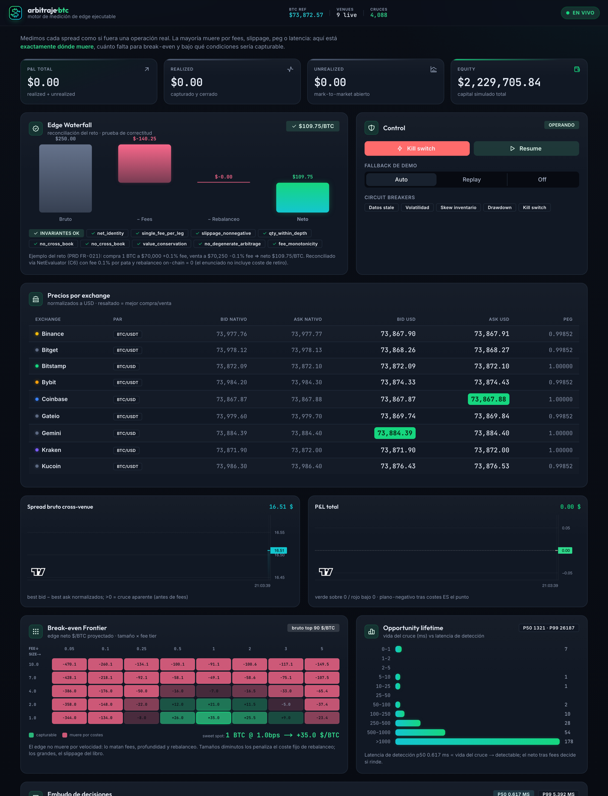
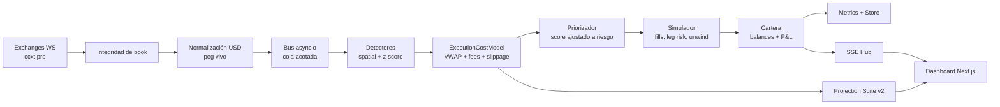

# arbitraje·btc

<p align="center">
  <strong>Motor de medición de edge ejecutable para arbitraje de BTC entre exchanges.</strong>
</p>

<p align="center">
  <a href="#quickstart"></a>
  <a href="#frontend"></a>
  <a href="#calidad"></a>
  <a href="#calidad"></a>
</p>

<p align="center">
  <strong>No busca "spreads grandes". Mide si un spread sobrevive a la realidad de ejecución.</strong>
</p>



---

## Qué Es

`arbitraje·btc` es un dashboard y motor backend que monitorea order books de BTC en múltiples
exchanges y evalúa cada cruce como si fuera una operación real:

```text
comprar BTC donde el ask es menor
vender BTC donde el bid es mayor
normalizar moneda
caminar el libro
restar fees, slippage, rebalanceo e impacto de latencia
decidir si el edge realmente es capturable
```

La mayoría de demos de arbitraje muestran:

```text
spread bruto = bid_B - ask_A
```

Este proyecto modela:

```text
edge ejecutable =
  VWAP_sell(q) - VWAP_buy(q)
  - fees taker por ambas patas
  - slippage por profundidad real
  - rebalanceo amortizado
  - riesgo de latencia / leg risk
  - peg adverso de stablecoins
```

La tesis es simple:

> El arbitraje de BTC parece dinero gratis hasta que se calcula como una operación real.
> Este sistema muestra exactamente dónde muere el edge y bajo qué condiciones sobrevive.

---

## Por Qué Importa

Bitcoin cotiza 24/7 en venues con liquidez, fees, pares y microestructura diferentes. Las
diferencias de precio existen, pero capturarlas exige responder preguntas muy concretas:

| Pregunta | Lo que hace el sistema |
|---|---|
| ¿El precio es comparable? | Normaliza USD/USDT con peg vivo; nunca asume 1.00. |
| ¿El spread es ejecutable? | Compra al ask y vende al bid; no usa last price. |
| ¿A qué tamaño sobrevive? | Camina niveles del order book y calcula VWAP. |
| ¿Qué lo mata? | Descompone fees, slippage, rebalanceo, peg y breakers. |
| ¿Somos suficientemente rápidos? | Mide p50/p99 y lifetime del cruce. |
| ¿Qué pasa si falla una pata? | Simula leg risk, fills parciales y unwind. |
| ¿El resultado es reproducible? | Replay point-in-time y validación determinista. |

---

## Qué Priorizamos

El proyecto está diseñado para demostrar criterio técnico, no sólo una interfaz llamativa. Las
prioridades fueron:

| Prioridad | Decisión |
|---|---|
| Correctitud financiera | Una sola fuente de cálculo (`ExecutionCostModel`) para backend, proyección y tests. |
| Realismo de ejecución | VWAP por niveles, fees taker por pata, slippage, rebalanceo y leg risk. |
| Baja latencia práctica | Monolito async, estado en memoria, colas acotadas y percentiles p50/p99. |
| Honestidad | Si el edge muere, se muestra por qué; no se maquilla el P&L. |
| Demo robusta | Modo live cuando hay mercado; fallback replay/demo cuando no hay feeds. |
| Auditoría | Reconciliación `$109.75`, invariantes, replay point-in-time y motivos de descarte. |
| Presentación | Dashboard tipo terminal quant: denso, legible y enfocado en decisión. |

La idea central es que un bot ingenuo detecta diferencias de precio; este sistema mide
**diferencias capturables**.

---

## Cómo Evaluarlo Rápido

Si sólo hay unos minutos para revisar el proyecto, esta es la ruta sugerida:

1. Abrir el dashboard y ver el **Edge Waterfall**: demuestra que la aritmética base reconcilia.
2. Revisar la **Break-even Frontier**: muestra dónde el edge vive o muere por tamaño y fee.
3. Revisar la **Capacity Curve**: explica por qué más capital no siempre mejora el resultado.
4. Revisar el **Forward Fan Chart**: comunica incertidumbre y no vende una curva falsa.
5. Revisar el **Embudo**: cada descarte tiene motivo técnico, no desaparece del sistema.
6. Ejecutar tests: `425 passed`, cobertura `93.38%`.

Lo más importante no es que aparezcan oportunidades verdes; es que el sistema sea capaz de decir
con precisión cuándo una oportunidad aparente **no debe operarse**.

---

## En Qué Es Mejor Que Un Bot Ingenuo

| Bot ingenuo | `arbitraje·btc` |
|---|---|
| Compara precios `last`. | Usa lados ejecutables: ask para compra, bid para venta. |
| Asume USDT = USD. | Usa peg vivo y descarta peg adverso. |
| Calcula spread top-of-book. | Camina el libro completo hasta el tamaño objetivo. |
| Ignora fees o usa un porcentaje fijo. | Configura fee taker por venue y tier. |
| No modela inventario. | Usa inventario pre-posicionado y rebalanceo amortizado. |
| No mide latencia. | Sella tiempos por etapa y reporta p50/p99. |
| No explica descartes. | Mantiene embudo con razones de descarte. |
| Backtest con riesgo de look-ahead. | Replay cronológico point-in-time. |
| Proyección como promesa. | Proyección como distribución e incertidumbre. |

---

## Lo Que Se Ve En Pantalla

### 1. Edge Waterfall

Reconciliación determinista del caso base:

```text
gross spread -> fees -> rebalanceo -> neto
```

Incluye invariantes económicas para demostrar que la aritmética no está maquillada:

- `net = gross - fees - rebalanceo`
- spread cero + fees positivas => neto negativo
- fees más altas nunca mejoran una oportunidad
- libros cruzados o corruptos no alimentan el motor

### 2. Break-even Frontier

Heatmap de `tamaño BTC × fee tier`:

- verde: edge neto positivo
- rojo: el trade muere por costes
- cada celda usa el mismo `ExecutionCostModel` del evaluador
- expone `P_survive` y Expected Capturable Edge
- marca el coste dominante: `fees`, `slippage`, `rebalance`

### 3. Capacity Curve

Curva de edge total contra capital desplegado:

- `Q*`: tamaño que maximiza edge total
- hard capacity: tamaño donde el edge vuelve a cruzar cero
- muestra cuándo agregar más capital destruye valor por slippage
- incluye overlay de impacto tipo square-root law

### 4. Forward Fan Chart

Proyección estadística de P&L usando bootstrap estacionario:

- no es predicción de precio
- muestra dispersión de resultados posibles
- reporta P(P&L > 0), drawdown esperado, PSR, Deflated Sharpe y MinTRL
- comunica incertidumbre en vez de prometer una curva ascendente

### 5. Embudo De Decisiones

Cada oportunidad pasa por un ciclo auditable:

```text
detected -> viable -> executable -> captured
                     \-> discarded(reason)
```

Motivos de descarte:

- `not_profitable_fees`
- `slippage_over_limit`
- `peg_adverse`
- `thin_book`
- `stale_venue`
- `breaker_active`
- `insufficient_balance`

---

## Arquitectura

Monolito modular asíncrono: un proceso, un event loop, estado en memoria y colas acotadas.
La decisión es deliberada: para un motor de mercado en tiempo real, evitar saltos de red y
serialización entre servicios es más valioso que distribuir prematuramente.



### Componentes Clave

| Capa | Módulos | Responsabilidad |
|---|---|---|
| Ingesta | `app/ingest` | Conexiones WS, backoff, sellado temporal. |
| Integridad | `app/integrity` | Validación estructural, orden de niveles, no-cross, secuencia. |
| Normalización | `app/normalize` | Conversión a USD con peg vivo. |
| Motor | `app/engine` | Detección espacial, z-score causal, neto, ranking. |
| Proyección | `app/projection` | Frontier, capacity curve, forward Monte Carlo. |
| Simulación | `app/sim` | Fills parciales, leg risk, unwind, inventario, rebalanceo. |
| Riesgo | `app/risk` | Staleness, volatilidad, skew, drawdown, kill switch. |
| Backtest | `app/backtest` | Record & replay point-in-time. |
| Métricas | `app/metrics` | Latencia, embudo, microestructura, lifetime. |
| API/Stream | `app/api`, `app/stream` | REST + SSE al frontend. |

---

## Modelo Económico

La fuente única de cálculo es `backend/app/engine/cost_model.py`.

Para un tamaño `q`:

```text
vwap_buy(q)  = caminar asks del venue barato hasta q
vwap_sell(q) = caminar bids del venue caro hasta q

gross     = (vwap_sell - vwap_buy) * filled
fees      = filled * vwap_buy * fee_buy + filled * vwap_sell * fee_sell
rebalance = rebalance_btc * vwap_buy
net       = gross - fees - rebalance
net/BTC   = net / filled
```

Este mismo modelo alimenta:

- evaluador de oportunidades
- Break-even Frontier
- Capacity Curve
- tests de invariantes
- endpoint de validación

Eso evita que la demo, el backend y el dashboard cuenten historias distintas.

---

## Projection Suite v2

La mejora principal del proyecto es que la proyección no intenta adivinar el precio de BTC.
Proyecta **capturabilidad**.

### Capa 1: Execution-Conditioned Frontier

```text
net_now -> P_survive(latency) -> Expected Capturable Edge
```

Modos:

- `demo`: determinista, útil para presentación y tests
- `live`: usa books vivos (`detector.books` / `latest_norm`)

### Capa 2: Capacity Curve

Responde cuánto capital absorbe el trade antes de que el slippage destruya el edge.

```text
edge_total(Q)    = neto total al tamaño Q
edge_marginal(Q) = Δ edge_total / Δ Q
Q*               = argmax edge_total
hard_capacity    = primer Q donde edge_total <= 0 después del pico
```

### Capa 3: Forward

Simula trayectorias de P&L desde la distribución empírica de trades.

No promete retorno. Muestra incertidumbre:

- fan chart P5/P25/P50/P75/P95
- probabilidad de terminar positivo
- drawdown esperado
- PSR / Deflated Sharpe / MinTRL

---

## API Principal

Backend base: `http://localhost:8000`

| Endpoint | Descripción |
|---|---|
| `GET /health` | Estado del servicio. |
| `GET /api/v1/stream` | SSE: quotes, opportunities, metrics, pnl, breakers. |
| `GET /api/v1/quotes` | Snapshot normalizado por exchange. |
| `GET /api/v1/opportunities` | Oportunidades recientes y funnel. |
| `GET /api/v1/metrics` | Latencia, microestructura, lifetime, ratios. |
| `GET /api/v1/validation` | Reconciliación e invariantes económicas. |
| `GET /api/v1/projection?mode=demo\|live` | Break-even Frontier v2. |
| `GET /api/v1/capacity?mode=demo\|live` | Capacity Curve. |
| `GET /api/v1/forward?n_paths=5000` | Forward fan chart. |
| `POST /api/v1/control/kill-switch` | Pausa global protegible con token. |
| `POST /api/v1/demo?mode=on` | Activa replay/demo fallback. |

Los modos inválidos de `projection` y `capacity` devuelven `422`, por contrato.

---

## Quickstart

### Requisitos

- Python 3.12 recomendado
- Node.js 18+
- `uv`
- npm

### Backend

```bash
cd backend
uv sync --python 3.12
uv run uvicorn app.main:app --host 0.0.0.0 --port 8000
```

Endpoints útiles:

```bash
curl http://localhost:8000/health
curl http://localhost:8000/api/v1/validation
curl http://localhost:8000/api/v1/projection?mode=demo
curl http://localhost:8000/api/v1/capacity?mode=demo
```

### Frontend

```bash
cd frontend
npm install
npm run dev
```

Dashboard:

```text
http://localhost:3000
```

### Atajos

```bash
make backend-dev
make frontend-dev
make backend-test
```

---

## Configuración

Todo lo económico y operativo vive en `backend/app/config.py` y puede sobrescribirse con variables
`ARB_`.

Ejemplos:

```bash
export ARB_INGEST_AUTOSTART=false
export ARB_CONTROL_TOKEN="<set-a-strong-token>"
export ARB_EXEC_LATENCY_MS=150
export ARB_EXPECTED_TRADES_PER_REBALANCE=5
export ARB_EXCHANGES__BINANCE__FEE_TAKER=0.001
```

Variables relevantes:

| Variable | Uso |
|---|---|
| `ARB_INGEST_AUTOSTART` | Arranca o desactiva feeds reales. |
| `ARB_CONTROL_TOKEN` | Protege endpoints de control. |
| `ARB_EXEC_LATENCY_MS` | Latencia simulada para leg risk/proyección. |
| `ARB_MAX_SLIPPAGE` | Filtro pre-trade de slippage. |
| `ARB_PEG_TOLERANCE` | Tolerancia de desviación stable/USD. |
| `ARB_EXPECTED_TRADES_PER_REBALANCE` | Amortización del coste fijo de rebalanceo. |
| `ARB_DB_URL` | SQLite/Postgres async. |

---

## Demo Y Resiliencia

El sistema está pensado para no depender de una condición perfecta de mercado:

- Si los feeds están vivos, opera en modo live.
- Si los feeds caen o no hay datos suficientes, el fallback puede inyectar replay.
- La validación y la Projection Suite en modo demo son deterministas.
- El dashboard marca explícitamente `DEMO DATA` cuando corresponde.

Para activar demo:

```bash
curl -X POST "http://localhost:8000/api/v1/demo?mode=on"
```

Para pausar el sistema:

```bash
curl -X POST "http://localhost:8000/api/v1/control/kill-switch"
```

Si `ARB_CONTROL_TOKEN` está configurado:

```bash
curl -X POST "http://localhost:8000/api/v1/control/kill-switch" \
  -H "X-Control-Token: $ARB_CONTROL_TOKEN"
```

---

## Calidad

Verificación final local:

```bash
cd backend
uv run pytest --cov=app --cov-report=term-missing --cov-fail-under=85
uv run ruff check app tests
uv run mypy --strict app

cd ../frontend
npm run typecheck
npm run lint
npm run build
```

Estado verificado:

| Gate | Resultado |
|---|---|
| Backend tests | `425 passed` |
| Cobertura | `93.38%` |
| Ruff | limpio |
| Mypy strict | limpio |
| Frontend typecheck | limpio |
| Next lint | limpio |
| Next build | OK |

Warning conocido:

- `StarletteDeprecationWarning` de `TestClient` con `httpx`; no afecta ejecución ni tests.

---

## Smoke Test

Con el backend levantado sin ingesta real:

```bash
ARB_INGEST_AUTOSTART=false \
ARB_DB_URL=sqlite+aiosqlite:///:memory: \
uv run uvicorn app.main:app --host 127.0.0.1 --port 8000
```

Validaciones:

```bash
curl http://127.0.0.1:8000/health
curl http://127.0.0.1:8000/api/v1/validation
curl http://127.0.0.1:8000/api/v1/projection?mode=demo
curl http://127.0.0.1:8000/api/v1/projection?mode=live
curl http://127.0.0.1:8000/api/v1/capacity?mode=demo
curl http://127.0.0.1:8000/api/v1/forward?n_paths=500
```

Sin feeds, `mode=live` cae honestamente a `demo`.

---

## Estructura Del Repo

```text
backend/
  app/
    api/          REST + SSE
    backtest/     record & replay point-in-time
    bus/          colas acotadas
    engine/       detectores, cost model, evaluador, ranking
    ingest/       ccxt.pro / exchange loops
    integrity/    validación estructural de books
    metrics/      latencia, microestructura, embudo
    models/       contratos pydantic
    normalize/    peg y normalización USD
    projection/   frontier, capacity, forward
    risk/         breakers + watchdog
    sim/          ejecución, cartera, rebalanceo
    store/        persistencia async/batch
    stream/       hub SSE
    validate/     reconciliación e invariantes
  tests/

frontend/
  app/
  components/
    BreakEvenFrontier.tsx
    CapacityCurve.tsx
    EdgeWaterfall.tsx
    ForwardFanChart.tsx
    FunnelPanel.tsx
    LiveLineChart.tsx
    OpportunitiesTable.tsx
    PricesTable.tsx
  hooks/
```

---

## Mejoras Implementadas

La versión actual incluye una capa de análisis más profunda que un MVP típico:

- `ExecutionCostModel` compartido para evitar drift entre evaluador, proyección y tests.
- Break-even Frontier v2 con `P_survive`, Expected Capturable Edge y coste dominante.
- Capacity Curve para estimar capacidad de capital y hard capacity.
- Forward Fan Chart con bootstrap estacionario y métricas de honestidad estadística.
- Endpoints `mode=demo|live` con validación estricta y fallback honesto.
- Cableado live contra `detector.books` / `latest_norm`, no contra estado ficticio.
- Tests HTTP de contratos de proyección, capacidad y forward.
- Dashboard actualizado con tres paneles de proyección.
- README como documentación única de entrega pública.

Estas mejoras están pensadas para que el proyecto no sólo "funcione", sino que explique sus
decisiones: qué vio, qué descartó, qué riesgo queda y qué tan defendible es el edge.

---

## Decisiones Técnicas

<details>
<summary><strong>Por qué monolito modular y no microservicios</strong></summary>

La ruta caliente necesita estado compartido de books, balances, métricas y oportunidades recientes.
Separarlo en servicios introduciría serialización, red y coordinación sin aportar valor para esta
escala. Un solo event loop con módulos claros permite baja latencia, tests rápidos y operación
simple.

</details>

<details>
<summary><strong>Por qué SSE y no WebSocket para todo</strong></summary>

El dashboard consume principalmente eventos servidor -> cliente. SSE tiene reconexión nativa,
atraviesa proxies con menos fricción y simplifica el fan-out. Los comandos de control son REST
protegibles con token.

</details>

<details>
<summary><strong>Por qué neto antes que bruto</strong></summary>

El spread bruto no compra ni vende nada. El sistema evalúa el lado ejecutable del book: comprar al
ask, vender al bid, recorrer niveles, cobrar fees y simular latencia. Si después de eso el P&L queda
plano o negativo, ese es el resultado correcto.

</details>

<details>
<summary><strong>Por qué forward no es predicción</strong></summary>

El forward usa la distribución empírica de P&L y bootstrap estacionario para mostrar dispersión,
no dirección futura del precio. La salida debe leerse como incertidumbre operacional: qué rango de
P&L es consistente con lo observado.

</details>

---

## Estado Del Proyecto

Implementado:

- ingesta multi-venue vía ccxt.pro
- normalización USD con peg vivo
- integridad estructural de order book
- detección espacial y estadística causal
- cálculo neto con fuente única (`ExecutionCostModel`)
- simulador taker con fills parciales, leg risk y unwind
- inventario pre-posicionado y rebalanceo periódico
- circuit breakers
- record & replay point-in-time
- métricas de latencia, microestructura y lifetime
- Projection Suite v2
- dashboard en tiempo real
- validación determinista e invariantes

Mejoras futuras razonables:

- calibrar `P_survive` con replay histórico más largo
- emitir evento SSE `projection` throttled en vez de polling
- sliders client-side para what-if de fee/latencia/tamaño
- iso-curva break-even sobre el heatmap
- persistencia Postgres en producción

## Idea Central

Este proyecto no intenta vender que el arbitraje de BTC es fácil. Hace lo contrario:

> toma cada oportunidad aparente, la obliga a pasar por la matemática real de ejecución,
> muestra qué fricción la destruye y cuantifica cuándo sí sería capturable.

Esa honestidad es el producto.
