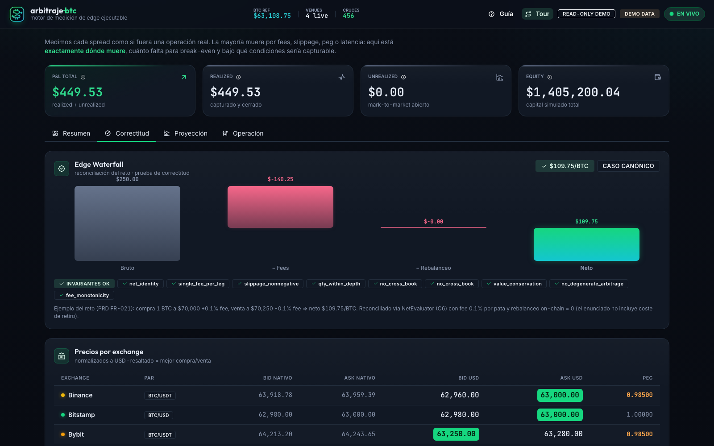
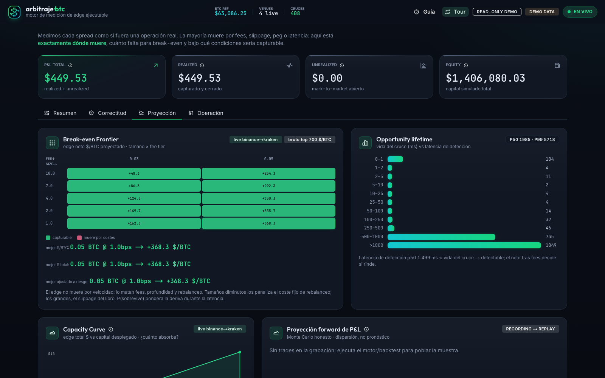
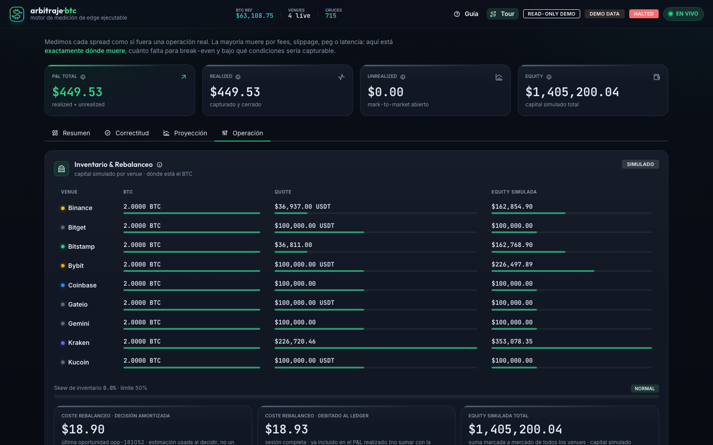
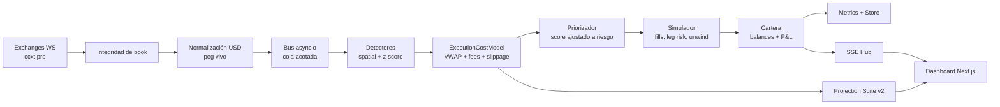
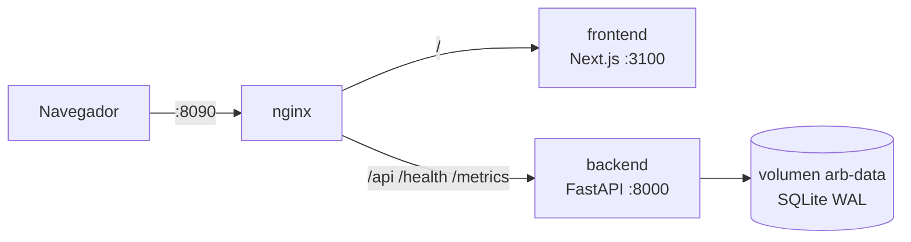

# arbitraje·btc

<p align="center">
  <strong>Motor de medición de edge ejecutable para arbitraje de BTC entre exchanges.</strong>
</p>

<p align="center">
  <a href="#quickstart"></a>
  <a href="#frontend"></a>
  <a href="#calidad"></a>
  <a href="#calidad"></a>
</p>

<p align="center">
  <strong>No busca "spreads grandes". Mide si un spread sobrevive a la realidad de ejecución.</strong>
</p>


> **Demo pública:** [http://159.89.187.165:8090](http://159.89.187.165:8090) — build read-only
> sobre feeds reales de 7 exchanges (health: [/health](http://159.89.187.165:8090/health),
> validación: [/api/v1/validation](http://159.89.187.165:8090/api/v1/validation)).

---

## Qué Es

`arbitraje·btc` es un dashboard y motor backend que monitorea order books de BTC en múltiples
exchanges y evalúa cada cruce como si fuera una operación real:

```text
comprar BTC donde el ask es menor
vender BTC donde el bid es mayor
normalizar moneda
caminar el libro
restar fees, slippage, rebalanceo e impacto de latencia
decidir si el edge realmente es capturable
```

La mayoría de demos de arbitraje muestran:

```text
spread bruto = bid_B - ask_A
```

Este proyecto modela:

```text
edge ejecutable =
  VWAP_sell(q) - VWAP_buy(q)
  - fees taker por ambas patas
  - slippage por profundidad real
  - rebalanceo amortizado
  - riesgo de latencia / leg risk
  - peg adverso de stablecoins
```

La tesis es simple:

> El arbitraje de BTC parece dinero gratis hasta que se calcula como una operación real.
> Este sistema muestra exactamente dónde muere el edge y bajo qué condiciones sobrevive.

---

## Por Qué Importa

Bitcoin cotiza 24/7 en venues con liquidez, fees, pares y microestructura diferentes. Las
diferencias de precio existen, pero capturarlas exige responder preguntas muy concretas:

| Pregunta | Lo que hace el sistema |
|---|---|
| ¿El precio es comparable? | Normaliza USD/USDT con peg vivo; nunca asume 1.00. |
| ¿El spread es ejecutable? | Compra al ask y vende al bid; no usa last price. |
| ¿A qué tamaño sobrevive? | Camina niveles del order book y calcula VWAP. |
| ¿Qué lo mata? | Descompone fees, slippage, rebalanceo, peg y breakers. |
| ¿Somos suficientemente rápidos? | Mide p50/p99 y lifetime del cruce. |
| ¿Qué pasa si falla una pata? | Simula leg risk, fills parciales y unwind. |
| ¿El resultado es reproducible? | Replay point-in-time y validación determinista. |

---

## Qué Priorizamos

El proyecto está diseñado para demostrar criterio técnico, no sólo una interfaz llamativa. Las
prioridades fueron:

| Prioridad | Decisión |
|---|---|
| Correctitud financiera | Una sola fuente de cálculo (`ExecutionCostModel`) para backend, proyección y tests. |
| Realismo de ejecución | VWAP por niveles, fees taker por pata, slippage, rebalanceo y leg risk. |
| Baja latencia práctica | Monolito async, estado en memoria, colas acotadas y percentiles p50/p99. |
| Honestidad | Si el edge muere, se muestra por qué; no se maquilla el P&L. |
| Demo robusta | Modo live cuando hay mercado; fallback replay/demo cuando no hay feeds. |
| Auditoría | Reconciliación `$109.75`, invariantes, replay point-in-time y motivos de descarte. |
| Presentación | Dashboard tipo terminal quant: denso, legible y enfocado en decisión. |

La idea central es que un bot ingenuo detecta diferencias de precio; este sistema mide
**diferencias capturables**.

**Alcance vs. negocio (decisión deliberada).** El core implementado y medido en vivo es
cross-exchange BTC spot: es donde la metodología se puede demostrar con datos públicos y
reconciliar al centavo. Los módulos triangular, funding/basis y corredor MXN existen como
opt-in (endpoints + tests, sin UI dedicada) a propósito: demuestran que la arquitectura
extiende la misma metodología a otras estructuras **sin mezclar sus riesgos** con el P&L
spot, no que el negocio esté ya capturado ahí.

---

## Cómo Evaluarlo Rápido

Si sólo hay unos minutos para revisar el proyecto, esta es la ruta sugerida:

1. Abrir el dashboard y ver el **Edge Waterfall**: demuestra que la aritmética base reconcilia.
2. Revisar la **Break-even Frontier**: muestra dónde el edge vive o muere por tamaño y fee.
3. Revisar la **Capacity Curve**: explica por qué más capital no siempre mejora el resultado.
4. Revisar el **Forward Fan Chart**: comunica incertidumbre y no vende una curva falsa.
5. Revisar el **Embudo**: cada descarte tiene motivo técnico, no desaparece del sistema.
6. Ejecutar tests: `547 passed`.

Lo más importante no es que aparezcan oportunidades verdes; es que el sistema sea capaz de decir
con precisión cuándo una oportunidad aparente **no debe operarse**.

Documentación de apoyo:

- [`docs/guion-demo-jurado.md`](docs/guion-demo-jurado.md): demo de 90 segundos, demo técnica de 5 minutos y preguntas esperadas.
- [`docs/configuracion.md`](docs/configuracion.md): guía de configuración con ejemplos y escenarios.
- [`docs/runbooks/`](docs/runbooks/README.md): procedimientos de operación (kill switch, feed stale, latencia alta, peg adverso).
- [`docs/evidencia-12jul/`](docs/evidencia-12jul/): paquete de evidencia del release candidato (gates, auditorías, API, capturas).
- [`deploy/README.md`](deploy/README.md): despliegue reproducible con Docker Compose.

---

## En Qué Es Mejor Que Un Bot Ingenuo

| Bot ingenuo | `arbitraje·btc` |
|---|---|
| Compara precios `last`. | Usa lados ejecutables: ask para compra, bid para venta. |
| Asume USDT = USD. | Usa peg vivo y descarta peg adverso. |
| Calcula spread top-of-book. | Camina el libro completo hasta el tamaño objetivo. |
| Ignora fees o usa un porcentaje fijo. | Configura fee taker por venue y tier. |
| No modela inventario. | Usa inventario pre-posicionado y rebalanceo amortizado. |
| No mide latencia. | Sella tiempos por etapa y reporta p50/p99. |
| No explica descartes. | Mantiene embudo con razones de descarte. |
| Backtest con riesgo de look-ahead. | Replay cronológico point-in-time. |
| Proyección como promesa. | Proyección como distribución e incertidumbre. |

---

## Lo Que Se Ve En Pantalla

### 1. Edge Waterfall

Reconciliación determinista del caso base:

```text
gross spread -> fees -> rebalanceo -> neto
```

Incluye invariantes económicas para demostrar que la aritmética no está maquillada:

- `net = gross - fees - rebalanceo`
- spread cero + fees positivas => neto negativo
- fees más altas nunca mejoran una oportunidad
- libros cruzados o corruptos no alimentan el motor

### 2. Break-even Frontier

Heatmap de `tamaño BTC × fee tier`:

- verde: edge neto positivo
- rojo: el trade muere por costes
- cada celda usa el mismo `ExecutionCostModel` del evaluador
- expone `P_survive` y Expected Capturable Edge
- marca el coste dominante: `fees`, `slippage`, `rebalance`

### 3. Capacity Curve

Curva de edge total contra capital desplegado:

- `Q*`: tamaño que maximiza edge total
- hard capacity: tamaño donde el edge vuelve a cruzar cero
- muestra cuándo agregar más capital destruye valor por slippage
- incluye overlay de impacto tipo square-root law

### 4. Forward Fan Chart

Proyección estadística de P&L usando bootstrap estacionario:

- no es predicción de precio
- muestra dispersión de resultados posibles
- reporta P(P&L > 0), drawdown esperado, PSR, Deflated Sharpe y MinTRL
- comunica incertidumbre en vez de prometer una curva ascendente

### 5. Embudo De Decisiones

Cada oportunidad pasa por un ciclo auditable:

```text
detected -> viable -> executable -> captured
                     \-> discarded(reason)
```

Motivos de descarte:

- `not_profitable_fees`
- `slippage_over_limit`
- `peg_adverse`
- `thin_book`
- `stale_venue`
- `breaker_active`
- `insufficient_balance`

### Vistas Del Dashboard

El dashboard se organiza en cuatro pestañas: **Resumen** (tesis y P&L), **Correctitud**
(reconciliación y embudo), **Proyección** (frontier, capacity, forward) y **Operación**
(inventario, control y configuración).

| | |
|---|---|
|  |  |
| *Correctitud: reconciliación $109.75 e invariantes* | *Proyección: Break-even Frontier en vivo y lifetime* |


*Operación: inventario por venue, rebalanceos y plano de control*

---

## Arquitectura

Monolito modular asíncrono: un proceso, un event loop, estado en memoria y colas acotadas.
La decisión es deliberada: para un motor de mercado en tiempo real, evitar saltos de red y
serialización entre servicios es más valioso que distribuir prematuramente.



### Componentes Clave

| Capa | Módulos | Responsabilidad |
|---|---|---|
| Ingesta | `app/ingest` | Conexiones WS, backoff, sellado temporal. |
| Integridad | `app/integrity` | Validación estructural, orden de niveles, no-cross, secuencia. |
| Normalización | `app/normalize` | Conversión a USD con peg vivo. |
| Motor | `app/engine` | Detección espacial, z-score causal, neto, ranking. |
| Proyección | `app/projection` | Frontier, capacity curve, forward Monte Carlo. |
| Simulación | `app/sim` | Fills parciales, leg risk, unwind, inventario, rebalanceo. |
| Riesgo | `app/risk` | Staleness, volatilidad, skew, drawdown, kill switch. |
| Backtest | `app/backtest` | Record & replay point-in-time. |
| Métricas | `app/metrics` | Latencia, embudo, microestructura, lifetime. |
| Estrategias | `app/strategies` | Módulos opt-in para triangular, funding y MXN sin mezclar riesgos. |
| API/Stream | `app/api`, `app/stream` | REST + SSE al frontend. |

---

## Modelo Económico

La fuente única de cálculo es `backend/app/engine/cost_model.py`.

Para un tamaño `q`:

```text
vwap_buy(q)  = caminar asks del venue barato hasta q
vwap_sell(q) = caminar bids del venue caro hasta q

gross     = (vwap_sell - vwap_buy) * filled
fees      = filled * vwap_buy * fee_buy + filled * vwap_sell * fee_sell
rebalance = rebalance_btc * vwap_buy
net       = gross - fees - rebalance
net/BTC   = net / filled
```

Este mismo modelo alimenta:

- evaluador de oportunidades
- Break-even Frontier
- Capacity Curve
- tests de invariantes
- endpoint de validación

Eso evita que la demo, el backend y el dashboard cuenten historias distintas.

---

## Projection Suite v2

La mejora principal del proyecto es que la proyección no intenta adivinar el precio de BTC.
Proyecta **capturabilidad**.

### Capa 1: Execution-Conditioned Frontier

```text
net_now -> P_survive(latency) -> Expected Capturable Edge
```

Modos:

- `demo`: determinista, útil para presentación y tests
- `live`: usa books vivos (`detector.books` / `latest_norm`)

### Capa 2: Capacity Curve

Responde cuánto capital absorbe el trade antes de que el slippage destruya el edge.

```text
edge_total(Q)    = neto total al tamaño Q
edge_marginal(Q) = Δ edge_total / Δ Q
Q*               = argmax edge_total
hard_capacity    = primer Q donde edge_total <= 0 después del pico
```

### Capa 3: Forward

Simula trayectorias de P&L desde la distribución empírica de trades.

No promete retorno. Muestra incertidumbre:

- fan chart P5/P25/P50/P75/P95
- probabilidad de terminar positivo
- drawdown esperado
- PSR / Deflated Sharpe / MinTRL

---

## API Principal

Backend base: `http://localhost:8000`

| Endpoint | Descripción |
|---|---|
| `GET /health` | Estado del servicio. |
| `GET /metrics` | Métricas Prometheus para operación/scraping. |
| `GET /api/v1/stream` | SSE: quotes, opportunities, metrics, pnl, breakers. |
| `GET /api/v1/quotes` | Snapshot normalizado por exchange. |
| `GET /api/v1/opportunities` | Oportunidades recientes y funnel. |
| `GET /api/v1/metrics` | Latencia, microestructura, lifetime, ratios. |
| `GET /api/v1/strategies` | Inventario de módulos de estrategia y flags. |
| `GET /api/v1/strategies/triangular/opportunities` | Triangular demo/replay, desactivado por defecto. |
| `GET /api/v1/strategies/funding/opportunities` | Funding/basis read-only, separado de P&L spot. |
| `GET /api/v1/strategies/regional/mxn` | Comparación BTC/MXN con FX explícito. |
| `GET /api/v1/validation` | Reconciliación e invariantes económicas. |
| `GET /api/v1/projection?mode=demo\|live` | Break-even Frontier v2. |
| `GET /api/v1/capacity?mode=demo\|live` | Capacity Curve. |
| `GET /api/v1/forward?n_paths=5000` | Forward fan chart. |
| `GET /api/v1/balances` | Inventario por venue + rebalanceos. |
| `GET /api/v1/pnl` | P&L y equity de la sesión simulada. |
| `GET /api/v1/opportunities/{id}/explain` | Desglose de costes y veredicto de una oportunidad. |
| `POST /api/v1/opportunities/{id}/what-if` | What-if read-only (fee/latencia/tamaño) sin tocar estado. |
| `GET /api/v1/session/export` | Export auditable de la sesión (nunca incluye el token). |
| `GET /api/v1/config/sim` · `PUT` | Configuración base del motor (el PUT exige token; inconsistencias → `422`/`409`). |
| `GET /api/v1/demo/scenarios` | Catálogo de escenarios esperado→observado para el jurado. |
| `POST /api/v1/control/kill-switch` · `/control/resume` | Pausa/reanuda global (token). |
| `POST /api/v1/demo?mode=on` | Activa replay/demo fallback (token). |

Los modos inválidos de `projection` y `capacity` devuelven `422`, por contrato. Todos los POST de
control exigen `X-Control-Token` cuando `ARB_CONTROL_TOKEN` está configurado.

---

## Quickstart

### Requisitos

- Python 3.12 recomendado
- Node.js 18+
- `uv`
- npm

### Backend

```bash
cd backend
uv sync --python 3.12
uv run uvicorn app.main:app --host 0.0.0.0 --port 8000
```

Endpoints útiles:

```bash
curl http://localhost:8000/health
curl http://localhost:8000/api/v1/validation
curl http://localhost:8000/api/v1/projection?mode=demo
curl http://localhost:8000/api/v1/capacity?mode=demo
```

### Frontend

```bash
cd frontend
npm install
npm run dev
```

Dashboard:

```text
http://localhost:3000
```

### Atajos

```bash
make backend-dev
make frontend-dev
make backend-test
```

---

## Despliegue Con Docker

El stack canónico de producción vive en `deploy/standalone/` (compose con 3 servicios detrás de
un solo puerto):



```bash
cd deploy/standalone
cp .env.example .env        # editar: ARB_CONTROL_TOKEN obligatorio
docker compose up -d --build
curl http://localhost:8090/health
```

Propiedades del deploy:

- **Un solo origen público** (`:8090`): nginx enruta `/api/` y `/health` al backend (con bloque
  dedicado sin buffering para el SSE) y el resto al frontend; no hay CORS ni puertos extra.
- **Arranque seguro por diseño**: con `ARB_ENV=prod` el backend **no arranca** sin
  `ARB_CONTROL_TOKEN`; el token viaja sólo como header, nunca en el bundle del frontend.
- **Persistencia real**: la DB vive en el volumen `arb-data` con WAL y `auto_vacuum=INCREMENTAL`;
  sobrevive `docker compose restart` y recreación de contenedores.
- **Build read-only para demo pública**: `NEXT_PUBLIC_READ_ONLY=1` como build-arg del frontend
  compila una UI sin controles mutantes (badge `READ-ONLY DEMO`); el backend sigue protegido por
  token de todas formas.
- Contenedores como usuario no-root, healthchecks con stdlib y `.dockerignore` que impide hornear
  datos en la imagen.

Variables del compose (`deploy/standalone/.env`):

| Variable | Uso |
|---|---|
| `ARB_CONTROL_TOKEN` | Obligatoria; el compose falla explícitamente si falta y el backend no arranca sin ella en prod. |
| `ARB_DB_RETENTION_HOURS` | Opcional (default 24). Dimensiona el disco: `horas × ~28 MB` (ej. `528` ≈ 15 GB). |

`ARB_ENV=prod`, la ruta de la DB en el volumen y `NEXT_PUBLIC_READ_ONLY=1` (build del frontend
sin controles de mutación, validado `0|1`) están fijados dentro del compose a propósito: el stack
público no puede levantarse accidentalmente en una variante insegura.

Detalle completo y troubleshooting en [`deploy/README.md`](deploy/README.md).

---

## Configuración

Todo lo económico y operativo vive en `backend/app/config.py` (pydantic-settings) y puede
sobrescribirse con variables de entorno con prefijo `ARB_` o con un archivo `backend/.env`:

```bash
export ARB_INGEST_AUTOSTART=false
export ARB_CONTROL_TOKEN="<set-a-strong-token>"
export ARB_EXEC_LATENCY_MS=150
export ARB_EXPECTED_TRADES_PER_REBALANCE=5
# El roster de venues se sobrescribe con el dict COMPLETO en JSON (un override
# parcial tipo ARB_EXCHANGES__X__FEE_TAKER no fusiona con defaults y no arranca):
export ARB_EXCHANGES='{"kraken":{"id":"kraken","symbol":"BTC/USD","quote_ccy":"USD","fee_taker":0.004,"withdrawal_btc":0.00005,"ob_limit":25}}'
```

El motor **arranca sin configurar nada**: todos los campos tienen defaults razonables.
Guía extendida con escenarios en [`docs/configuracion.md`](docs/configuracion.md).

### Variables esenciales

| Variable | Default | Uso |
|---|---|---|
| `ARB_ENV` | `dev` | Entorno. Con `prod`, el arranque **falla** si falta `ARB_CONTROL_TOKEN`. |
| `ARB_CONTROL_TOKEN` | vacío | Protege los POST de control (`X-Control-Token`). Vacío = sin auth (solo dev). |
| `ARB_INGEST_AUTOSTART` | `true` | Conecta los feeds WS reales al arrancar. `false` para smoke/CI. |
| `ARB_DB_URL` | `sqlite+aiosqlite:///./arbitraje.db` | Persistencia async (SQLite o Postgres). |
| `ARB_DB_RETENTION_HOURS` | `24` | Ventana de datos retenida; la poda corre de fondo. `0` = sin límite. |
| `ARB_DEFAULT_TRADE_QTY_BTC` | `1.0` | Tamaño objetivo con el que se camina el libro. |

### Todas las variables

<details>
<summary><strong>Servidor y seguridad</strong></summary>

| Variable | Default | Explicación |
|---|---|---|
| `ARB_APP_NAME` | `arbitraje-btc` | Nombre reportado en `/health`. |
| `ARB_ENV` | `dev` | `dev` \| `prod`. En `prod` exige `ARB_CONTROL_TOKEN` (validador en arranque). |
| `ARB_LOG_LEVEL` | `INFO` | Nivel de logging. |
| `ARB_CORS_ORIGINS` | `["http://localhost:3000"]` | Orígenes permitidos para el frontend. |
| `ARB_CONTROL_TOKEN` | vacío | Token de los endpoints de control (kill-switch, resume, demo, config, retención). Comparación en tiempo constante; token no-ASCII responde `401`. |
| `ARB_API_KEY` | vacío | Si se setea, todas las rutas `/api/v1/*` exigen header `X-API-Key` (salvo health/docs). |
| `ARB_API_RATE_LIMIT_PER_MIN` | `0` | Límite de requests/min por cliente. `0` = sin límite. |

</details>

<details>
<summary><strong>Exchanges y mercado</strong></summary>

| Variable | Default | Explicación |
|---|---|---|
| `ARB_EXCHANGES` | 7 venues activos | Roster completo en JSON: por venue `id`, `symbol`, `quote_ccy`, `fee_taker` (fracción), `withdrawal_btc` (coste on-chain), `ob_limit` (profundidad), `initial_btc` (2.0), `initial_quote` (100000), `enabled`. Sustituye el dict entero; los venues omitidos desaparecen. |
| `ARB_QUOTE_TARGET` | `USD` | Moneda de normalización de todos los books. |
| `ARB_INGEST_AUTOSTART` | `true` | Arranca los WS loops en el lifespan. |
| `ARB_INGEST_MAX_BACKOFF` | `30.0` | Tope (s) del backoff exponencial de reconexión. |

</details>

<details>
<summary><strong>Bus, SSE y throttling</strong></summary>

| Variable | Default | Explicación |
|---|---|---|
| `ARB_BUS_MAXSIZE` | `1000` | Cola interna acotada (drop-oldest bajo presión). |
| `ARB_SSE_CLIENT_QUEUE_MAXSIZE` | `500` | Cola de eventos por cliente SSE. |
| `ARB_SSE_MAX_CLIENTS` | `64` | Tope de clientes SSE concurrentes (anti-DoS en deploy público). `0` = sin límite. |
| `ARB_SSE_PING_SECONDS` | `15` | Keep-alive del stream. |
| `ARB_QUOTE_THROTTLE_MS` | `100` | Máx. ~10 quotes/s por venue hacia el cliente. |

</details>

<details>
<summary><strong>Peg y normalización</strong></summary>

| Variable | Default | Explicación |
|---|---|---|
| `ARB_PEG_PAIRS` | `{"USDT": "USDT/USD"}` | Pares usados para medir el peg vivo. |
| `ARB_PEG_SOURCE_EXCHANGE` | `kraken` | Venue de referencia del peg. |
| `ARB_PEG_TOLERANCE` | `0.005` | Desviación máxima stable/USD (±0.5%); peor ⇒ descarte `peg_adverse`. |

</details>

<details>
<summary><strong>Economía de ejecución</strong></summary>

| Variable | Default | Explicación |
|---|---|---|
| `ARB_MIN_NET_PROFIT_USD` | `0.0` | Umbral de neto por trade para considerarlo viable. |
| `ARB_NET_MARGIN_BUFFER_BPS` | `0.0` | Colchón extra sobre el ruido del peg. |
| `ARB_MAX_SLIPPAGE` | `0.0010` | Filtro pre-trade de slippage (0.10%). |
| `ARB_EXEC_LATENCY_MS` | `150` | Latencia simulada de ejecución (leg risk y proyección). |
| `ARB_DEFAULT_TRADE_QTY_BTC` | `1.0` | Tamaño objetivo del cruce. |
| `ARB_EXPECTED_TRADES_PER_REBALANCE` | `1.0` | Amortización del coste fijo on-chain entre N trades (decisión, no ledger). |

</details>

<details>
<summary><strong>Detección y ranking</strong></summary>

| Variable | Default | Explicación |
|---|---|---|
| `ARB_ZSCORE_WINDOW` | `200` | Ventana W del z-score causal (100–300 ticks). |
| `ARB_Z_OPEN` / `ARB_Z_CLOSE` / `ARB_Z_STOP` | `2.0` / `0.5` / `3.0` | Umbrales de apertura, cierre y stop de la señal estadística. |
| `ARB_SCORE_PFILL_FLOOR` | `0.05` | P(fill) mínima usada en el score. |
| `ARB_SCORE_RISK_AVERSION_BPS` | `10.0` | Penalización de deriva adversa (bps/s de latencia sobre el notional). |

</details>

<details>
<summary><strong>Riesgo y breakers</strong></summary>

| Variable | Default | Explicación |
|---|---|---|
| `ARB_STALENESS_MS` | `750` | Book más viejo que esto ⇒ el venue sale del cómputo. |
| `ARB_WATCHDOG_INTERVAL_MS` | `250` | Cadencia del watchdog (~staleness/3). |
| `ARB_INVENTORY_SKEW_LIMIT` | `0.5` | Desvío de inventario permitido antes de rebalancear. |
| `ARB_MAX_DRAWDOWN_USD` | `5000` | Kill switch automático por drawdown. |
| `ARB_VOLATILITY_BREAKER_BPS` | `200` | Breaker por rango de mid en la ventana de volatilidad. |
| `ARB_BREAKER_INTERVAL_MS` | `500` | Cadencia de recomputo de breakers. |
| `ARB_VOLATILITY_WINDOW_MS` | `5000` | Ventana del breaker de volatilidad. |
| `ARB_REBALANCE_INTERVAL_MS` | `30000` | Cadencia del chequeo de drift de inventario (periódico, no por trade). |
| `ARB_INTEGRITY_MODE` | `warn` | `generic` \| `warn` \| `enforce`: rigor de validación de books por venue. |

</details>

<details>
<summary><strong>Demo, replay y backtest</strong></summary>

| Variable | Default | Explicación |
|---|---|---|
| `ARB_DEMO_FALLBACK_ENABLED` | `true` | Arma el fallback a replay cuando no hay datos vivos. |
| `ARB_DEMO_STALE_MS` | `2000` | Sin dato real durante esto ⇒ activa el replay. |
| `ARB_DEMO_REPLAY_INTERVAL_MS` | `50` | Cadencia de inyección de ticks en replay. |
| `ARB_DEMO_RECORDING_PATH` | vacío | JSONL de respaldo si el buffer vivo está vacío. |
| `ARB_RECORD_ENABLED` | `true` | Graba books normalizados (ring buffer) para replay. |
| `ARB_RECORD_MAXLEN` | `20000` | Tamaño del ring de grabación. |
| `ARB_BACKTEST_IN_SAMPLE_FRAC` | `0.7` | Split in/out-of-sample del replay. |

</details>

<details>
<summary><strong>Ejecución protegida (testnet/dry-run)</strong></summary>

| Variable | Default | Explicación |
|---|---|---|
| `ARB_EXECUTION_MODE` | `disabled` | `disabled` \| `dry_run` \| `testnet`. Ninguna ruta de ejecución sin opt-in explícito. |
| `ARB_ENABLE_TEST_ORDERS` | `false` | Permite `test order` en testnet. |
| `ARB_EXECUTION_REQUEST_TIMEOUT_S` | `5.0` | Timeout de la petición de ejecución. |
| `ARB_BINANCE_TESTNET_API_KEY/SECRET` | vacío | Credenciales SOLO de testnet. |
| `ARB_EXECUTION_LOCAL_BTC_BALANCE` | `1.0` | Balance local del adapter determinista (no es dinero real). |
| `ARB_EXECUTION_LOCAL_QUOTE_BALANCE_USD` | `100000` | Quote local del adapter determinista. |

</details>

<details>
<summary><strong>Estrategias opt-in (PRD-008)</strong></summary>

| Variable | Default | Explicación |
|---|---|---|
| `ARB_STRATEGY_TRIANGULAR_ENABLED` | `false` | Triangular demo/replay. |
| `ARB_STRATEGY_TRIANGULAR_START_CURRENCY` | `USD` | Moneda inicial del ciclo triangular. |
| `ARB_STRATEGY_TRIANGULAR_TRADE_SIZE` | `1000` | Notional del ciclo. |
| `ARB_STRATEGY_TRIANGULAR_MIN_PROFIT_BPS` | `0` | Umbral de reporte. |
| `ARB_STRATEGY_FUNDING_ENABLED` | `false` | Funding/basis read-only (separado del P&L spot). |
| `ARB_STRATEGY_FUNDING_HEDGE_COST_BPS` | `0` | Coste de hedge descontado. |
| `ARB_STRATEGY_REGIONAL_MXN_ENABLED` | `false` | Comparación BTC/MXN experimental. |
| `ARB_STRATEGY_MXN_USD_RATE` | — | FX USD/MXN explícito (requerido si MXN está activo). |
| `ARB_STRATEGY_MXN_FIAT_FEE_BPS` | `20` | Fricción fiat del corredor MXN. |

</details>

<details>
<summary><strong>Métricas, calibración y persistencia</strong></summary>

| Variable | Default | Explicación |
|---|---|---|
| `ARB_METRICS_WINDOW` | `2000` | Muestras por métrica en ventana. |
| `ARB_LIFETIME_GAP_MS` | `250` | Gap que cierra un episodio de cruce. |
| `ARB_METRICS_EMIT_MS` | `1000` | Cadencia máx. del push SSE de métricas. |
| `ARB_CALIBRATION_MODE` | `observe_only` | `observe_only` \| `report` \| `score` \| `gate` para P_survive. |
| `ARB_SHADOW_SAMPLE_MAXLEN` | `20000` | Muestras shadow para calibración. |
| `ARB_SURVIVAL_LATENCIES_MS` | `[50,100,200,500,1000]` | Latencias evaluadas en supervivencia. |
| `ARB_DB_URL` | `sqlite+aiosqlite:///./arbitraje.db` | SQLite o Postgres async. |
| `ARB_STORE_BATCH_SIZE` | `100` | Tamaño de batch de escritura. |
| `ARB_STORE_FLUSH_SECONDS` | `1.0` | Flush periódico del store. |
| `ARB_DB_RETENTION_HOURS` | `24` | Ventana retenida. Las opportunities entran a ~36/s (~670 MB/día); dimensiona disco = `horas × 28 MB`. Ej.: `528` h ≈ 15 GB. |
| `ARB_DB_PRUNE_INTERVAL_S` | `300` | Cadencia de la poda de fondo. |
| `ARB_DB_VACUUM_ON_PRUNE` | `false` | VACUUM tras podar (recupera disco; costoso). |

</details>

---

## Demo Y Resiliencia

El sistema está pensado para no depender de una condición perfecta de mercado:

- Si los feeds están vivos, opera en modo live.
- Si los feeds caen o no hay datos suficientes, el fallback puede inyectar replay.
- La validación y la Projection Suite en modo demo son deterministas.
- El dashboard marca explícitamente `DEMO DATA` cuando corresponde.

Para activar demo:

```bash
curl -X POST "http://localhost:8000/api/v1/demo?mode=on"
```

Para pausar el sistema:

```bash
curl -X POST "http://localhost:8000/api/v1/control/kill-switch"
```

Si `ARB_CONTROL_TOKEN` está configurado:

```bash
curl -X POST "http://localhost:8000/api/v1/control/kill-switch" \
  -H "X-Control-Token: $ARB_CONTROL_TOKEN"
```

---

## Calidad

Verificación final local:

```bash
cd backend
uv run pytest --cov=app --cov-report=term-missing --cov-fail-under=85
uv run ruff check app tests
uv run mypy --strict app

cd ../frontend
npm run typecheck
npm run lint
npm run build
```

Estado verificado:

| Gate | Resultado |
|---|---|
| Backend tests | `547 passed` |
| Cobertura | `91.64%` (`--cov-fail-under=85`) |
| Ruff | limpio |
| Mypy strict | limpio |
| Frontend typecheck | limpio |
| Next lint | limpio |
| Next build | limpio |

Warning conocido:

- `StarletteDeprecationWarning` de `TestClient` con `httpx`; no afecta ejecución ni tests.

---

## Smoke Test

Con el backend levantado sin ingesta real:

```bash
ARB_INGEST_AUTOSTART=false \
ARB_DB_URL=sqlite+aiosqlite:///:memory: \
uv run uvicorn app.main:app --host 127.0.0.1 --port 8000
```

Validaciones:

```bash
curl http://127.0.0.1:8000/health
curl http://127.0.0.1:8000/api/v1/validation
curl http://127.0.0.1:8000/api/v1/projection?mode=demo
curl http://127.0.0.1:8000/api/v1/projection?mode=live
curl http://127.0.0.1:8000/api/v1/capacity?mode=demo
curl http://127.0.0.1:8000/api/v1/forward?n_paths=500
```

Sin feeds, `mode=live` cae honestamente a `demo`.

---

## Estructura Del Repo

```text
backend/
  app/
    api/          REST + SSE
    backtest/     record & replay point-in-time
    bus/          colas acotadas
    engine/       detectores, cost model, evaluador, ranking
    ingest/       ccxt.pro / exchange loops
    integrity/    validación estructural de books
    metrics/      latencia, microestructura, embudo
    models/       contratos pydantic
    normalize/    peg y normalización USD
    projection/   frontier, capacity, forward
    risk/         breakers + watchdog
    sim/          ejecución, cartera, rebalanceo
    store/        persistencia async/batch
    stream/       hub SSE
    validate/     reconciliación e invariantes
  tests/

frontend/
  app/            layout, error boundaries, página principal con tabs
  components/     25 paneles: EdgeWaterfall, BreakEvenFrontier, CapacityCurve,
                  ForwardFanChart, FunnelPanel, InventoryPanel, ControlPanel,
                  ConfigPanel, StrategyLabPanel, NaiveVsEdgePanel, WinsPanel,
                  OpportunityExplainDrawer, SurvivalCalibrationPanel, ...
  hooks/          useStream (SSE + polling ligero/pesado con backoff)
  lib/            config (READ_ONLY build-time), format (locales fijos)

deploy/
  Dockerfile              backend (uv frozen, non-root, /data)
  standalone/             compose canónico: backend + frontend + nginx (:8090)
```

---

## Mejoras Implementadas

La versión actual incluye una capa de análisis más profunda que un MVP típico:

- `ExecutionCostModel` compartido para evitar drift entre evaluador, proyección y tests.
- Break-even Frontier v2 con `P_survive`, Expected Capturable Edge y coste dominante.
- Capacity Curve para estimar capacidad de capital y hard capacity.
- Forward Fan Chart con bootstrap estacionario y métricas de honestidad estadística.
- Endpoints `mode=demo|live` con validación estricta y fallback honesto.
- Cableado live contra `detector.books` / `latest_norm`, no contra estado ficticio.
- Tests HTTP de contratos de proyección, capacidad y forward.
- Dashboard actualizado con tres paneles de proyección.
- Ledger atómico validate-then-apply: ninguna ejecución puede dejar balances inconsistentes.
- Build read-only del frontend para demo pública + plano de control con token en tiempo constante.
- Panel de inventario y rebalanceo con timestamps reales.
- Escenarios esperado→observado deterministas para auditar la demo en vivo.
- Retención de BD configurable con poda incremental (la DB ya no crece sin límite).
- Deploy reproducible: compose canónico con volumen persistente, healthcheck real y non-root.
- README como documentación única de entrega pública.

Estas mejoras están pensadas para que el proyecto no sólo "funcione", sino que explique sus
decisiones: qué vio, qué descartó, qué riesgo queda y qué tan defendible es el edge.

---

## Decisiones Técnicas

<details>
<summary><strong>Por qué monolito modular y no microservicios</strong></summary>

La ruta caliente necesita estado compartido de books, balances, métricas y oportunidades recientes.
Separarlo en servicios introduciría serialización, red y coordinación sin aportar valor para esta
escala. Un solo event loop con módulos claros permite baja latencia, tests rápidos y operación
simple.

</details>

<details>
<summary><strong>Por qué SSE y no WebSocket para todo</strong></summary>

El dashboard consume principalmente eventos servidor -> cliente. SSE tiene reconexión nativa,
atraviesa proxies con menos fricción y simplifica el fan-out. Los comandos de control son REST
protegibles con token.

</details>

<details>
<summary><strong>Por qué neto antes que bruto</strong></summary>

El spread bruto no compra ni vende nada. El sistema evalúa el lado ejecutable del book: comprar al
ask, vender al bid, recorrer niveles, cobrar fees y simular latencia. Si después de eso el P&L queda
plano o negativo, ese es el resultado correcto.

</details>

<details>
<summary><strong>Por qué forward no es predicción</strong></summary>

El forward usa la distribución empírica de P&L y bootstrap estacionario para mostrar dispersión,
no dirección futura del precio. La salida debe leerse como incertidumbre operacional: qué rango de
P&L es consistente con lo observado.

</details>

---

## Estado Del Proyecto

Implementado:

- ingesta multi-venue vía ccxt.pro
- normalización USD con peg vivo
- integridad estructural de order book
- detección espacial y estadística causal
- cálculo neto con fuente única (`ExecutionCostModel`)
- simulador taker con fills parciales, leg risk y unwind
- inventario pre-posicionado y rebalanceo periódico
- circuit breakers
- record & replay point-in-time
- métricas de latencia, microestructura y lifetime
- Projection Suite v2
- módulos PRD-008 opt-in para triangular, funding/basis y MXN
- dashboard en tiempo real
- validación determinista e invariantes

Mejoras futuras razonables:

- calibrar `P_survive` con replay histórico más largo
- emitir evento SSE `projection` throttled en vez de polling
- sliders client-side para what-if de fee/latencia/tamaño
- iso-curva break-even sobre el heatmap
- persistencia Postgres en producción

## Idea Central

Este proyecto no intenta vender que el arbitraje de BTC es fácil. Hace lo contrario:

> toma cada oportunidad aparente, la obliga a pasar por la matemática real de ejecución,
> muestra qué fricción la destruye y cuantifica cuándo sí sería capturable.

Esa honestidad es el producto.
