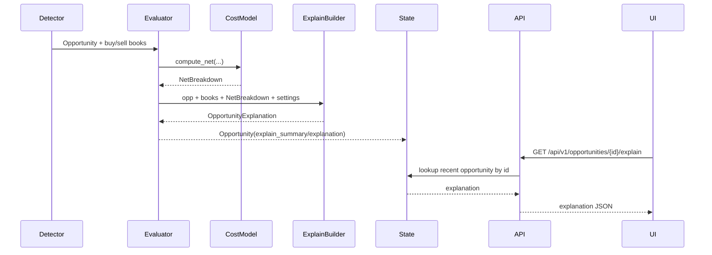

# Arquitectura PRD-001: Opportunity Explain + Naive Comparison

## Objetivo arquitectónico

Agregar una capa de explicación por oportunidad que use la economía existente (`ExecutionCostModel`) y exponga una comparación contra un bot ingenuo, sin duplicar fórmulas ni inflar el stream SSE.

## Estado actual relevante

- `AppState.recent_opps` guarda las últimas oportunidades en memoria.
- `GET /api/v1/opportunities` serializa `recent_opps`.
- `NetEvaluator.evaluate` calcula VWAP, fees, slippage y neto.
- `ExecutionCostModel.compute_net` es la fuente única de la economía.
- `OpportunitiesTable` muestra estadísticas agregadas por ruta, no una oportunidad individual.

## Componentes nuevos

```text
backend/app/models/explain.py
backend/app/engine/explain.py
frontend/components/OpportunityExplainDrawer.tsx
frontend/components/NaiveVsEnginePanel.tsx
```

## Cambios en componentes existentes

```text
backend/app/models/opportunity.py       -> campo explain_summary opcional o explanation_id
backend/app/engine/evaluator.py         -> invoca builder de explicación
backend/app/state.py                    -> índice por id para lookup rápido
backend/app/api/v1/router.py            -> endpoint explain
frontend/hooks/useStream.ts             -> tipos y fetch por id
frontend/components/OpportunitiesTable.tsx -> row click / selected route-opportunity
```

## Modelo de datos

Crear modelos Pydantic separados para evitar crecer demasiado `Opportunity`.

```python
class CostComponent(BaseModel):
    key: str
    label: str
    usd: float
    per_btc: float | None = None

class NaiveComparison(BaseModel):
    buy_price: float | None
    sell_price: float | None
    spread_usd_per_btc: float | None
    gross_usd: float | None
    would_trade: bool

class EngineDecision(BaseModel):
    status: str
    reason: str | None
    net_usd: float | None
    net_per_btc: float | None
    dominant_cost: str | None
    trades: bool

class OpportunityExplanation(BaseModel):
    id: str
    route: dict[str, str]
    q_target: float
    naive: NaiveComparison
    engine: EngineDecision
    breakdown: list[CostComponent]
    timestamps: dict[str, float | None]
```

## Flujo



## Builder puro

`backend/app/engine/explain.py` debe ser una función sin I/O:

```python
def build_explanation(
    opp: Opportunity,
    buy_book: NormalizedBook,
    sell_book: NormalizedBook,
    net: NetBreakdown,
    settings: Settings,
) -> OpportunityExplanation:
    ...
```

Reglas:

- No recalcular neto manualmente.
- Si necesita gross/fees/slippage usa `NetBreakdown`.
- Si `NetBreakdown` no existe para descartes tempranos, devuelve explanation parcial.
- `naive.would_trade` debe depender de spread bruto y umbral mínimo simple, no de neto.

## Estado y lookup

Agregar en `AppState`:

```python
opps_by_id: dict[str, Opportunity] = field(default_factory=dict)
```

En `record_opportunity`:

```python
self.opps_by_id[opp.id] = opp
if len(self.opps_by_id) > self.recent_opps.maxlen * 2:
    prune ids not in recent_opps
```

Esto evita escanear el deque en cada request y mantiene memoria acotada.

## API

```http
GET /api/v1/opportunities/{id}/explain
```

Errores:

- `404` si no existe.
- `409` si existe pero todavía no tiene explicación completa.

## Frontend

Agregar estado local:

```ts
const [selectedOpportunityId, setSelectedOpportunityId] = useState<string | null>(null);
const [selectedExplanation, setSelectedExplanation] = useState<OpportunityExplanation | null>(null);
```

Cambios de UX:

- Tabla muestra rutas agregadas como hoy.
- Donde haya oportunidad reciente individual, click abre drawer.
- Si se mantiene tabla por ruta, usar el último `opportunity_id` por ruta en `RouteStat`.

## Rollout

1. Backend explanation y endpoint.
2. Tests de contrato.
3. UI drawer escondido detrás de click.
4. Ajustar tabla para exponer `opportunity_id`.

## Pruebas

- Unit: builder con oportunidad viable.
- Unit: builder con `not_profitable_fees`.
- Unit: builder con `thin_book`.
- API: endpoint 200/404.
- Regression: `GET /opportunities` conserva forma previa.
- Frontend: drawer tolera explanation parcial.

## Riesgos y mitigación

- Payload SSE grande: no mandar explanation completa por SSE.
- Doble fórmula: builder recibe `NetBreakdown`.
- Oportunidad no encontrada: mantener buffer acotado e indicar expiración.

