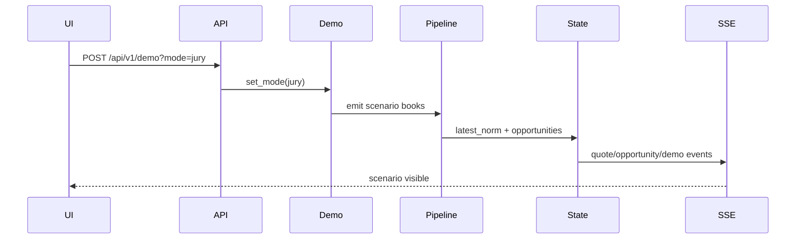

# Arquitectura PRD-002: Demo determinista + export de sesión

## Objetivo arquitectónico

Agregar un reproductor de escenarios deterministas para jurado y un export de sesión que capture evidencia auditable sin depender de red externa.

## Estado actual relevante

- `DemoFallback` puede activar replay/demo.
- `Recorder` guarda ticks en memoria y puede JSONL.
- `GET/POST /api/v1/demo` ya existe.
- El dashboard muestra badge cuando `demo.active`.

## Componentes nuevos

```text
backend/app/demo/scenarios.py
backend/app/demo/jury.py
backend/app/models/session.py
frontend/components/SessionExportButton.tsx
```

## Cambios existentes

```text
backend/app/demo/fallback.py       -> soportar modo jury o delegar a JuryScenarioPlayer
backend/app/api/v1/router.py       -> /session/export y mode=jury
backend/app/state.py               -> session metadata opcional
frontend/components/ControlPanel.tsx -> botón JURY DEMO y export
frontend/hooks/useStream.ts        -> DemoStatus con scenario
docs/guion-demo-jurado.md          -> flujo actualizado
```

## Modelo de escenarios

```python
class DemoScenario(BaseModel):
    id: str
    label: str
    description: str
    books: list[RawOrderBook]
    expected: dict[str, Any]

class JuryDemoStatus(BaseModel):
    active: bool
    mode: Literal["off", "auto", "on", "jury"]
    source: str
    scenario: str | None
    scenario_index: int | None
    n_scenarios: int
```

Escenarios:

- `good_edge`
- `naive_trap`
- `peg_adverse`
- `stale_feed`
- `latency_decay`

## Flujo demo



## Export de sesión

Endpoint:

```http
GET /api/v1/session/export
```

Builder puro:

```python
def build_session_export(ctx: AppState) -> SessionExport:
    ...
```

Contenido:

- metadata: timestamp, app version si existe, mode.
- settings saneados: no secretos, solo flags y parámetros económicos.
- quotes recientes.
- opportunities recientes.
- explanations si PRD-001 está implementado.
- metrics snapshot.
- breakers status.
- demo status.
- validation report.

## Redacción de secretos

Lista blanca, no lista negra. Exportar solo claves explícitamente permitidas:

```python
SAFE_SETTINGS = {
    "env",
    "default_trade_qty_btc",
    "max_slippage",
    "exec_latency_ms",
    "peg_tolerance",
    "min_net_profit_usd",
}
```

## API

```http
POST /api/v1/demo?mode=jury
GET /api/v1/session/export
```

`POST /api/v1/demo?mode=jury` debe requerir token de control igual que `mode=on/off/auto`.

## Rollout

1. Crear scenarios con books crudos mínimos.
2. Crear `JuryScenarioPlayer`.
3. Integrar con `DemoFallback`.
4. Exponer status extendido.
5. Crear session export.
6. UI: botón y badge de escenario.
7. Actualizar guion.

## Pruebas

- Escenario emite books en orden.
- `jury` no requiere red.
- `session/export` redacted.
- Demo status incluye escenario actual.
- UI soporta `mode=jury`.

## Riesgos y mitigación

- Confundir demo con live: badge persistente `DEMO/JURY`.
- Escenarios demasiado optimistas: incluir `naive_trap` y `peg_adverse`.
- Fuga de secretos: export por lista blanca.

