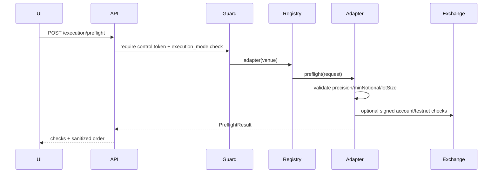

# Arquitectura PRD-003: Testnet preflight + test order

## Objetivo arquitectónico

Agregar una capa de ejecución segura y desactivada por defecto que valide órdenes contra reglas de exchange y permita test orders sin tocar dinero real.

## Estado de implementación

Implementación inicial completada:

- Settings, guards, modelos y endpoints.
- Registry de venues soportados.
- Adapter Binance Spot Testnet determinista/offline para `BTCUSDT`.
- UI mínima en el drawer de oportunidad.
- Tests de flags, token, min notional, lot size, venue no soportado y redacción de secretos.

Pendiente para conectar testnet real:

- Reemplazar la respuesta offline por llamada firmada a Binance Spot Testnet `order/test`.
- Cargar `exchangeInfo` real y cachearlo con TTL.
- Validar balances de cuenta testnet vía endpoint firmado.

## Estado actual relevante

- El sistema simula ejecución en `ExecutionSimulator`.
- Hay endpoints de control protegidos por token.
- `Settings` centraliza flags `ARB_`.
- No existe paquete `execution`.

## Componentes nuevos

```text
backend/app/execution/__init__.py
backend/app/execution/models.py
backend/app/execution/preflight.py
backend/app/execution/binance.py
backend/app/execution/registry.py
backend/app/models/preflight.py
```

## Settings nuevos

```python
execution_mode: Literal["disabled", "dry_run", "testnet"] = "disabled"
enable_test_orders: bool = False
binance_testnet_api_key: str | None = None
binance_testnet_api_secret: str | None = None
execution_request_timeout_s: float = 5.0
```

Regla: `execution_mode=disabled` gana siempre.

## Interfaz de adapter

```python
class ExecutionAdapter(Protocol):
    venue: str
    async def preflight(self, req: PreflightRequest) -> PreflightResult: ...
    async def test_order(self, req: TestOrderRequest) -> TestOrderResult: ...
```

Adapter inicial:

```text
BinanceTestnetAdapter (offline determinista; no red)
```

## Flujo preflight



## API

```http
POST /api/v1/execution/preflight
POST /api/v1/execution/test-order
GET /api/v1/execution/status
```

Todos los `POST` requieren token de control.

## Modelos

```python
class PreflightCheck(BaseModel):
    name: str
    passed: bool
    detail: str | None = None

class PreflightRequest(BaseModel):
    opportunity_id: str | None = None
    venue: str
    side: Literal["buy", "sell"]
    symbol: str
    quantity_btc: float
    order_type: Literal["market", "limit"]
    limit_price: float | None = None

class PreflightResult(BaseModel):
    mode: str
    accepted: bool
    venue: str
    symbol: str
    checks: list[PreflightCheck]
    sanitized_order: dict[str, Any]
```

## Seguridad

- No se serializan API keys.
- Logs con payload saneado.
- `test-order` requiere `enable_test_orders=true`.
- No hay fallback a live si testnet falla.
- No se reusa cliente de market data para ejecución.

## Integración UI

P1 mínimo:

- Botón en drawer de oportunidad: `Preflight`.
- Mostrar lista de checks.
- Botón `Test order` solo si status permite.

## Rollout

1. Settings y guards.
2. Modelos y registry.
3. Adapter fake para tests.
4. Binance adapter.
5. Endpoints.
6. UI mínima.
7. Docs de configuración.

## Fuentes oficiales para la siguiente conexión real

- Binance Spot REST API: endpoint `POST /api/v3/order/test`.
- Binance Spot Test Network REST: base URL de testnet.

## Pruebas

- Disabled por defecto.
- Token requerido.
- Test order bloqueado sin flag.
- Adapter fake valida lot size/min notional.
- Respuesta no contiene secretos.

## Riesgos y mitigación

- Riesgo de live accidental: no configurar URLs live en adapter inicial.
- Superficie de secretos: lista blanca de output y redacción en logs.
- Cambios API Binance: encapsular request signing y exchange info.
