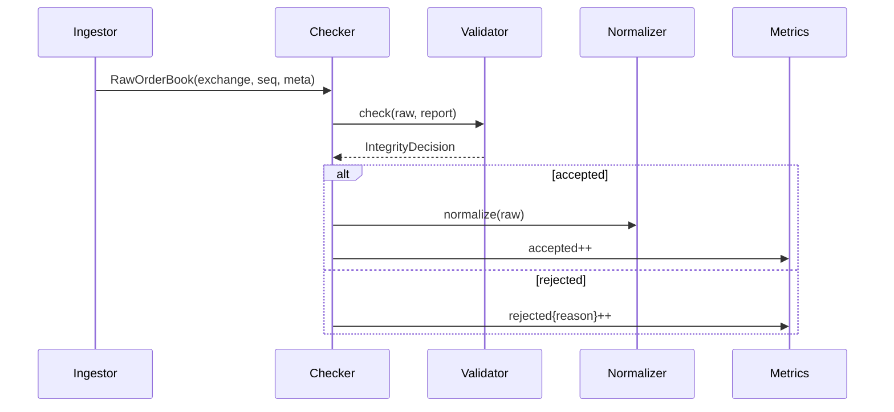

# Arquitectura PRD-004: Integridad específica por exchange

## Objetivo arquitectónico

Evolucionar la integridad desde validación estructural genérica hacia validadores por venue con sequence/checksum/gap reporting.

## Estado de implementación

Implementación inicial completada:

- `RawOrderBook.meta` preserva metadata específica disponible desde ccxt.pro.
- `BookIntegrityChecker` usa registry por venue.
- `integrity_mode=warn` observa sin bloquear fallos específicos.
- `integrity_mode=enforce` bloquea gaps/checksum específicos.
- Validadores:
  - Binance: continuidad `U/u` cuando metadata está disponible.
  - Kraken: CRC32 top-10 cuando checksum está disponible.
  - Coinbase: sequence/gap handling básico.
- `GET /api/v1/integrity`, `/health` y `/api/v1/metrics` exponen reportes.

Pendiente:

- Verificar en vivo qué metadata exacta preserva ccxt.pro por exchange.
- Guardar strings originales de precio/cantidad para checksum Kraken exacto si ccxt los expone.
- Agregar OKX/Bitfinex si se reactivan live.

## Estado actual relevante

- `BookIntegrityChecker` valida estructura y `seq` monótona.
- `ExchangeIngestor._to_raw` construye `RawOrderBook`.
- `RawOrderBook` tiene `seq`, pero no `meta`.
- `/health` puede exponer reportes de integridad.

## Componentes nuevos

```text
backend/app/integrity/models.py
backend/app/integrity/validators.py
backend/app/integrity/binance.py
backend/app/integrity/kraken.py
backend/app/integrity/coinbase.py
```

## Cambios existentes

```text
backend/app/models/market.py       -> RawOrderBook.meta: dict[str, Any]
backend/app/ingest/exchange_ingestor.py -> preservar metadata disponible
backend/app/integrity/checker.py   -> registry + reportes extendidos
backend/app/api/health.py          -> integridad enriquecida
backend/app/api/v1/router.py       -> GET /integrity
backend/app/metrics/collector.py   -> counters por venue/reason
```

## Modelo de integridad

```python
class IntegrityDecision(BaseModel):
    accepted: bool
    reason: str | None = None
    validator: str
    seq: int | None = None
    checksum: str | None = None
    severity: Literal["info", "warn", "error"] = "error"

class IntegrityReport(BaseModel):
    validator: str
    accepted: int
    rejected: int
    sequence_gaps: int
    checksum_failures: int
    last_reason: str | None
    last_seq: int | None
    last_valid_at: float | None
```

## Interfaz validator

```python
class VenueIntegrityValidator(Protocol):
    name: str
    def check(self, raw: RawOrderBook, report: IntegrityReport) -> IntegrityDecision: ...
```

## Registry

```python
VALIDATORS = {
    "binance": BinanceIntegrityValidator(),
    "kraken": KrakenIntegrityValidator(),
    "coinbase": CoinbaseIntegrityValidator(),
}
```

Fallback: `GenericIntegrityValidator`.

## Flujo



## Metadata

Agregar a `RawOrderBook`:

```python
meta: dict[str, Any] = Field(default_factory=dict)
```

Ejemplos:

- Binance: `first_update_id`, `final_update_id`, `last_update_id`.
- Kraken: `checksum`.
- Coinbase: `sequence`, `channel`, `snapshot`.

Si `ccxt.pro` no expone metadata suficiente, validator debe degradar a `generic` o `warn`, no inventar certeza.

## API

```http
GET /api/v1/integrity
```

Además, `/health` debe incluir resumen corto:

```json
"integrity": {
  "binance": {"accepted": 100, "rejected": 0, "validator": "binance"}
}
```

## Rollout

1. Extraer generic validator actual.
2. Agregar `meta`.
3. Reportes extendidos sin enforcing específico.
4. Binance sequence validator en modo `warn`.
5. Kraken checksum en modo `warn`.
6. Pasar a `enforce` por config.

## Config

```python
integrity_mode: Literal["generic", "warn", "enforce"] = "warn"
```

Semántica:

- `generic`: sólo validador estructural común.
- `warn`: validadores específicos reportan gaps/checksum pero no bloquean.
- `enforce`: validadores específicos también bloquean libros fallidos.

## Pruebas

- Generic mantiene comportamiento actual.
- Binance gap incrementa `sequence_gaps`.
- Kraken checksum failure incrementa `checksum_failures`.
- Endpoint contrato.
- `warn` no bloquea, `enforce` bloquea.

## Riesgos y mitigación

- Metadata no disponible: fallback explícito.
- Falsos positivos de checksum: fixture por venue.
- Bloquear feeds buenos: rollout `warn` antes de `enforce`.
