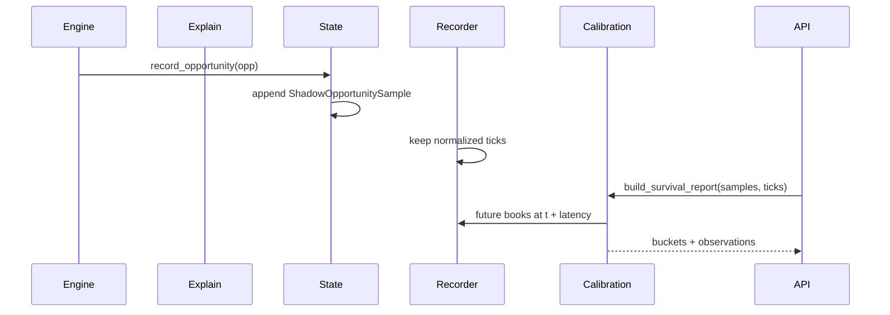

# Arquitectura PRD-005: Calibración de supervivencia con shadow replay

## Objetivo arquitectónico

Medir si las oportunidades sobreviven después de una ventana de latencia y usar esa evidencia para calibrar `P_survive` sin introducir un modelo opaco ni look-ahead.

## Estado de implementación

Implementación inicial completada:

- `ShadowOpportunitySample`, `SurvivalObservation`, buckets y reporte.
- Ring buffer `shadow_samples` en `AppState`.
- Captura observe-only después del estado final de cada oportunidad.
- Evaluador point-in-time sobre ticks futuros del `Recorder`.
- Endpoint `GET /api/v1/calibration/survival`.
- Export de sesión con muestras shadow recientes.
- Panel UI `SurvivalCalibrationPanel`.

Pendiente:

- Usar calibración para ranking en modo `score`.
- Activar gating sólo con evidencia suficiente en modo `gate`.
- Persistir dataset shadow si se necesita análisis multi-sesión.

## Estado actual relevante

- `projection/survival.py` calcula `P_survive` con una heurística gaussiana.
- `Recorder` conserva ticks normalizados.
- `backtest/replay.py` puede re-evaluar segmentos point-in-time.
- `MetricsCollector` ya calcula lifetime y embudo.

## Componentes nuevos

```text
backend/app/calibration/__init__.py
backend/app/calibration/samples.py
backend/app/calibration/survival.py
backend/app/models/calibration.py
frontend/components/SurvivalCalibrationPanel.tsx
```

## Cambios existentes

```text
backend/app/state.py                  -> shadow_samples ring buffer
backend/app/main.py                   -> registrar sample al final de on_opp
backend/app/backtest/replay.py        -> helper de future book lookup
backend/app/api/v1/router.py          -> /calibration/survival
backend/app/projection/survival.py    -> opcional: calibrator read-only
frontend/hooks/useStream.ts           -> polling ligero del endpoint
```

## Modelo de datos

```python
class ShadowOpportunitySample(BaseModel):
    id: str
    ts_detect: float
    strategy: str
    symbol: str
    buy_venue: str
    sell_venue: str
    q_target: float
    net_usd: float | None
    net_per_btc: float | None
    fees_usd: float | None
    slippage_usd: float | None
    dominant_cost: str | None
    status: str
    discard_reason: str | None
    p_survive_estimated: float | None
    features: dict[str, float | str | None]

class SurvivalObservation(BaseModel):
    opportunity_id: str
    latency_ms: int
    observed: bool | None
    future_net_usd: float | None
    reason: str | None = None

class SurvivalCalibrationBucket(BaseModel):
    p_low: float
    p_high: float
    n: int
    estimated_mid: float
    observed_rate: float | None
    abs_error: float | None
```

## Flujo de captura



## Regla anti look-ahead

El sample se guarda en `t_detect`. La observación solo se calcula bajo demanda usando ticks posteriores del recorder. Nunca se escribe `future_net_usd` dentro de la oportunidad original.

## Evaluador de supervivencia

```python
def evaluate_survival(
    sample: ShadowOpportunitySample,
    ticks: list[NormalizedBook],
    latencies_ms: Sequence[int],
    settings: Settings,
) -> list[SurvivalObservation]:
    ...
```

Para cada latencia:

1. Buscar book futuro de buy venue y sell venue con `ts_recv_monotonic >= sample.ts_detect + latency`.
2. Si no hay book futuro disponible, devolver `observed=None`, `reason="missing_future_book"`.
3. Re-evaluar misma ruta y `q_target`.
4. `observed=True` si `future_net_usd > settings.min_net_profit_usd`.

## Endpoint

```http
GET /api/v1/calibration/survival?latency_ms=100
```

Respuesta:

```json
{
  "mode": "observe_only",
  "latency_ms": 100,
  "n_samples": 120,
  "n_observed": 80,
  "buckets": [],
  "confidence": "medium"
}
```

Implementado:

```http
GET /api/v1/calibration/survival?latency_ms=100&observation_limit=50
```

## Integración con `P_survive`

Fase inicial: no tocar ranking ni decisiones.

Estado actual: `observe_only` únicamente. El endpoint recomputa `p_survive` por latencia y
lo compara contra `observed_rate` en buckets.

Fase posterior:

```python
class SurvivalEstimator:
    def estimate(sample_features) -> float:
        return heuristic_p_survive
```

Luego puede leer calibración por bucket, pero solo cuando `n >= min_samples`.

## UI

Panel pequeño:

- `estimated vs observed`
- samples
- confidence
- latencia seleccionada

No debe bloquear la demo principal.

## Rollout

1. Shadow sample ring buffer.
2. Endpoint observe-only.
3. Tests anti look-ahead.
4. Panel opcional.
5. Uso para ranking solo en PR futuro.

## Pruebas

- Captura sample con campos mínimos.
- Future lookup no usa ticks anteriores.
- Missing future book se reporta.
- Buckets calculan observed rate.
- Observe-only no cambia oportunidades.

## Riesgos y mitigación

- Pocas muestras: confidence explícita.
- Alto costo al calcular endpoint: cache TTL corto.
- Sesgo por demo: marcar `source=demo/live/replay` en samples.
