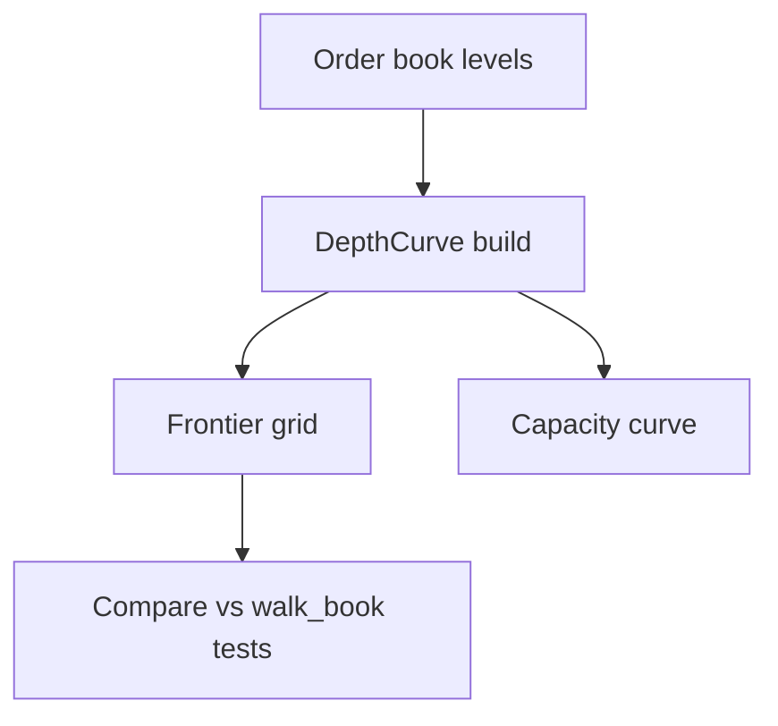

# Arquitectura PRD-007: Rendimiento y curvas de profundidad

## Objetivo arquitectónico

Reducir trabajo repetido al calcular VWAP para múltiples tamaños, sin cambiar resultados ni oscurecer el evaluador.

## Estado actual relevante

- `walk_book(levels, q)` camina niveles linealmente.
- `ExecutionCostModel.compute_net` llama `walk_book`.
- `frontier` y `capacity` evalúan muchos tamaños.
- No hay profiling reproducible.

## Componentes nuevos

```text
backend/app/engine/depth_curve.py
backend/scripts/profile_engine.py
```

## Cambios existentes

```text
backend/app/engine/bookmath.py         -> compatibilidad y helpers
backend/app/projection/frontier.py     -> usar DepthCurve en grillas
backend/app/projection/capacity.py     -> usar DepthCurve
Makefile                               -> profile-engine
```

## DepthCurve

```python
@dataclass(frozen=True)
class DepthCurve:
    side: Literal["bid", "ask"]
    prices: tuple[float, ...]
    qty_cum: tuple[float, ...]
    notional_cum: tuple[float, ...]

    @classmethod
    def from_levels(cls, levels: list[PriceLevel], side: str) -> "DepthCurve": ...
    def vwap(self, q: float) -> tuple[float, float]: ...
```

## Algoritmo

Para `q`:

1. Buscar primer índice donde `qty_cum[i] >= q`.
2. Si no existe, filled = última cantidad acumulada.
3. Notional completo hasta nivel anterior + parcial del nivel actual.
4. VWAP = notional / filled.

Complejidad:

- Construcción: O(n)
- Query: O(log n) con `bisect`

## Integración

Fase 1: projection.

```python
ask_curve = DepthCurve.from_levels(asks, "ask")
bid_curve = DepthCurve.from_levels(bids, "bid")
for size in sizes:
    vwap_buy, filled_buy = ask_curve.vwap(size)
```

Fase 2: evaluator solo si profiling lo justifica.

## Profiling

Script:

```bash
make profile-engine
```

Salida:

```text
walk_book_p95_ms=...
depth_curve_p95_ms=...
projection_demo_ms=...
projection_live_ms=...
```

## Flujo



## Pruebas

- DepthCurve contra `walk_book` exact fill.
- DepthCurve contra `walk_book` partial fill.
- Empty book.
- q mayor que profundidad.
- Projection demo no cambia dentro de tolerancia.

## Rollout

1. Tests de equivalencia.
2. DepthCurve sin uso productivo.
3. Integrar projection.
4. Medir.
5. Decidir evaluator.

## Riesgos y mitigación

- Error en nivel parcial: property-based tests con books sintéticos.
- Diferencias float: tolerancia definida.
- Complejidad innecesaria: mantener `walk_book` como fuente conceptual simple.
