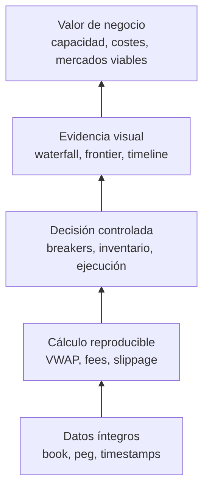
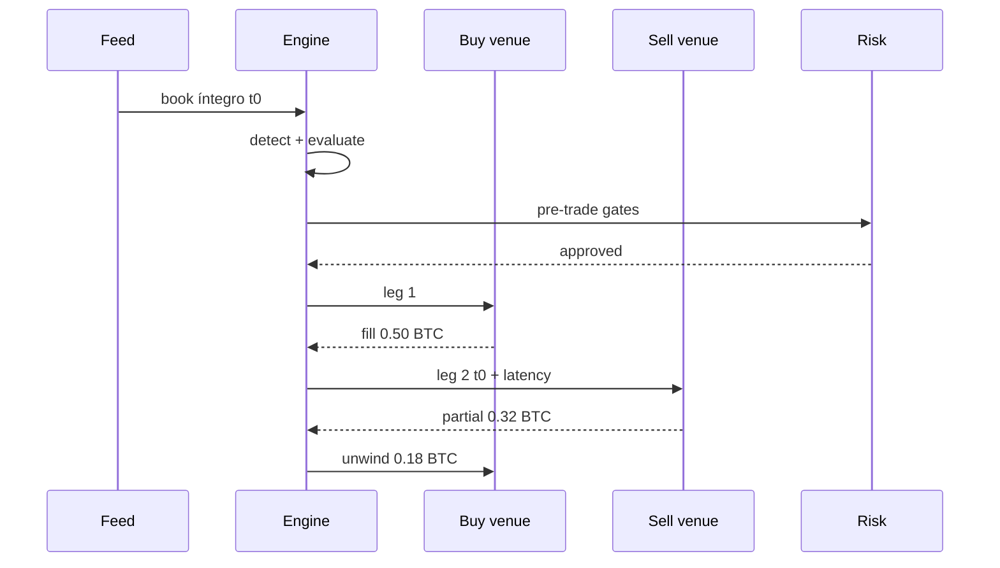
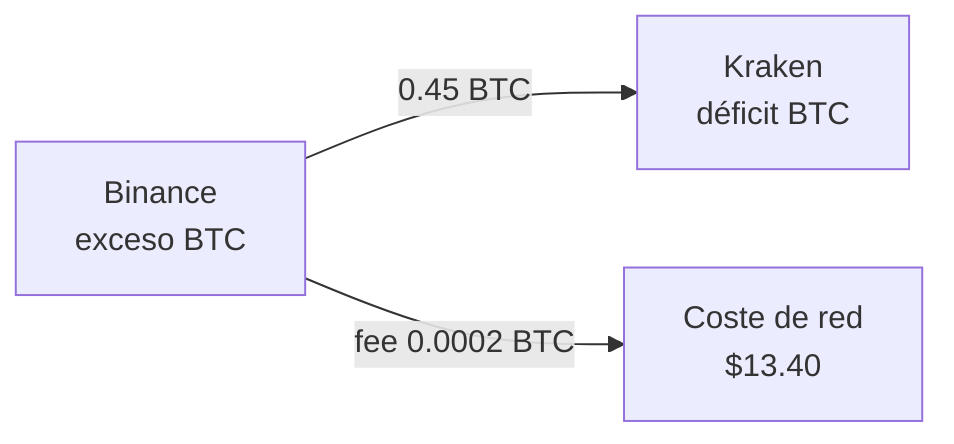
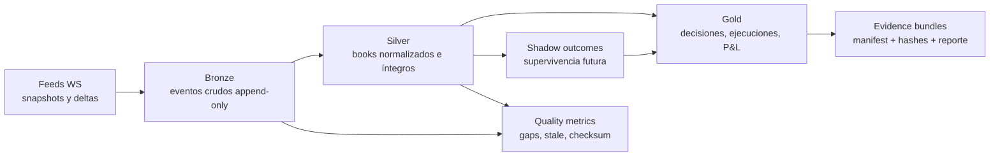
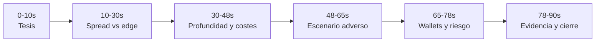
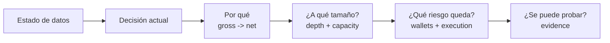

# Plan integral de mejora del proyecto

> Fecha de revisión: 11 de julio de 2026 · **Actualizado con la auditoría cruzada del mismo día**
> (5 análisis paralelos: backend, frontend, docs/pendientes, jurado adversarial y diseño visual;
> plan táctico del día final en `docs/plan-cierre-12jul.md`)  
> Proyecto: `arbitraje-btc` · Cierre del comité: **12-jul-2026 23:59**  
> Alcance: backend, frontend, modelo financiero, operación, despliegue, seguridad,
> pruebas, documentación y experiencia de producto.

## 1. Objetivo

Este documento convierte la revisión integral del repositorio en un plan de trabajo priorizado.
El objetivo no es agregar funcionalidades por volumen, sino hacer que el sistema sea:

- correcto en su contabilidad y decisiones financieras;
- reproducible entre desarrollo, CI y producción;
- operable sin estados engañosos;
- seguro para un visor público y una consola de operador;
- fácil de mantener y probar;
- comprensible para jurado, analistas, operadores y desarrolladores.

La tesis del producto sigue siendo válida y diferenciadora:

> El sistema no busca spreads grandes; mide si el edge sobrevive a profundidad, fees,
> slippage, latencia, inventario, peg y rebalanceo.

## 2. Estado verificado

La base técnica es sólida:

| Gate | Resultado verificado |
|---|---:|
| Backend tests | 507 passing |
| Cobertura backend | 91.03% |
| Ruff | limpio |
| Mypy strict | limpio |
| TypeScript | limpio |
| ESLint / Next lint | limpio |
| Next production build | correcto |
| First Load JS | 264 kB |
| Server público (159.89.187.165:8090) | ❌ caído — el deploy ya no existe (ver P0-0) |

Fortalezas defendibles:

- fuente única para la aritmética de costes;
- walk-the-book compartido entre evaluación y simulación;
- replay point-in-time sin look-ahead en la decisión;
- fills parciales, leg risk y unwind (hoy solo los ejercita el backtest; en vivo son código
  muerto — ver P1-6);
- inventario pre-posicionado y contabilidad de doble entrada;
- colas acotadas con política drop-oldest;
- proyecciones pesadas fuera del event loop;
- demo determinista, explicación de oportunidades y export de sesión;
- runbooks, métricas Prometheus y health operacional;
- UX orientada a explicar por qué una oportunidad vive o muere.

La principal brecha ya no es el modelo conceptual. Es la coherencia entre configuración viva,
contabilidad, autenticación, persistencia y despliegue.

## 3. Hallazgos priorizados

### P0-0. El deploy público ya no existe en el servidor

**Severidad:** crítica (bloquea la demo pública del 12-jul)  
**Áreas afectadas:** operación y entrega.

Verificado por SSH el 11-jul: `/opt/arbitraje-btc` fue borrado de kavasoft — ni código fuente,
ni imágenes Docker del proyecto, ni el `.env` con el token. El server responde (ping/SSH ok, UFW
conserva la regla `8090/tcp`) pero el puerto 8090 está cerrado; solo corren los servicios de
Easy Panel.

#### Corrección recomendada (redeploy desde cero)

1. `rsync` del repo a `/opt/arbitraje-btc` (excluir `.git`, `node_modules`, `.venv`, `.next`,
   `*.db` **y `.env`** — los secretos se crean directamente en el server, nunca viajan con el
   repo).
2. Recrear `deploy/standalone/.env` con `ARB_CONTROL_TOKEN` (**obligatorio**: el backend no
   arranca con `ARB_ENV=prod` y token vacío) — `openssl rand -hex 24`.
3. `docker compose build && docker compose up -d` en `deploy/standalone/`.
4. Gotchas conocidos del server: `docker compose restart nginx` tras recrear contenedores
   (nginx resuelve IPs al arrancar); puerto interno 3100 para el frontend (Easy Panel bloquea el
   3000 entre contenedores); `up -d --force-recreate backend` tras rebuild.
5. Aprovechar el redeploy para aplicar P0-3 (volumen SQLite): la DB nueva nace con
   `auto_vacuum=INCREMENTAL` y evita el `VACUUM` one-shot que necesitaría una DB heredada.
6. Aprovechar también para P0-4: instalar el backend desde el lockfile
   (`uv sync --frozen --no-dev` en el Dockerfile) — partir de cero vuelve casi gratis lo que en
   un deploy vivo sería una migración.

Secuencia (adoptada del plan de cierre): **no redesplegar antes de cerrar P0-1 y P0-2** —
desplegar una build incorrecta duplica el trabajo y arriesga enseñarla. Matiz nuestro: un smoke
de infra temprano y desechable (rsync + build + `/health` con la build actual, 30-45 min)
desriesga Docker/red/UFW por la mañana en lugar de descubrir un problema de infraestructura a
las 22:00; la build final se despliega igual al cierre. Guardar backup del volumen antes de
cualquier redeploy posterior.

#### Criterios de aceptación

- `curl /health` → 200 con todas las tasks `alive`; SSE fluye y el badge pasa a "EN VIVO".
- Kill switch con token → 200; sin token → 401 (verificado contra el server, no solo local).
- Los 7 escenarios jury disparan desde la UI pública.

### P0-1. Configuración de venues puede producir P&L inconsistente

**Severidad:** crítica  
**Áreas afectadas:** correctitud financiera, inventario, configuración, operación.

#### Evidencia

- `backend/app/store/config_store.py:51-85` cambia `enabled` en `Settings`.
- `backend/app/api/v1/router.py:519-551` aplica la configuración y ejecuta
  `portfolio.reseed()`.
- `backend/app/main.py:282-286` crea los ingestors solamente durante el arranque.
- `backend/app/sim/inventory.py:229-232` devuelve `True` si un venue no existe en el portfolio.
- `backend/app/sim/inventory.py:359-387` ignora patas de venues desconocidos, pero suma el P&L
  realizado de la ejecución.

#### Reproducción confirmada

Al deshabilitar Kraken y resembrar el portfolio:

```text
venues = [binance]
can_afford = true
execution_pnl = 9.46
portfolio_realized_pnl = 9.46
```

La pata de Binance modifica balances, la pata de Kraken se ignora y el P&L se registra. Esto rompe
la atomicidad de la operación y permite reconocer una ganancia sin aplicar todos sus movimientos
físicos.

#### Corrección recomendada

1. `Portfolio.can_afford()` debe devolver `False` si falta cualquier venue requerido.
2. `Portfolio.apply_execution()` debe validar todas las patas antes de mutar un solo balance.
3. Una ejecución inválida debe rechazarse completa; nunca aplicarse parcialmente.
4. Deshabilitar un venue debe detener su ingestor y eliminar sus libros de `latest_books`,
   `latest_norm`, detector, watchdog e integridad.
5. Habilitar un venue debe arrancar su ingestor mediante un supervisor de feeds.
6. Si no se implementa el supervisor ahora, `enabled` debe declararse `restart_required` y no
   aplicarse en caliente.

#### Criterios de aceptación

- Un venue no sembrado siempre produce `insufficient_balance` o `venue_disabled`.
- Una ejecución con una pata desconocida no cambia balances ni P&L.
- Deshabilitar un venue impide nuevas oportunidades con ese venue.
- Existe una prueba integrada mediante `PUT /api/v1/config/sim` que reproduce el caso.
- Se conserva el invariante de doble entrada antes y después del cambio de configuración.

### P0-2. La consola web no puede operar en producción

**Severidad:** alta  
**Áreas afectadas:** UX, seguridad, operación.

#### Evidencia

- `backend/app/config.py:245-255` exige `ARB_CONTROL_TOKEN` cuando `ARB_ENV=prod`.
- `frontend/components/ControlPanel.tsx:44-57` no envía `X-Control-Token`.
- `frontend/components/ConfigPanel.tsx:93-97` tampoco lo envía.
- Strategy Lab, retención, preflight y test order siguen el mismo patrón.

En producción, las acciones aparecen disponibles, pero responden `401`. Incrustar el token como
`NEXT_PUBLIC_*` no es una solución: expondría un secreto operativo a cualquier navegador.

#### Corrección recomendada

Separar dos superficies:

| Superficie | Acceso | Capacidades |
|---|---|---|
| Visor público | anónimo o API key de lectura | dashboard, métricas, explicación, demo pasiva |
| Consola de operador | sesión autenticada | kill switch, configuración, retención, preflight |

Implementación preferida:

- autenticación OIDC o sesión propia con cookie `HttpOnly`, `Secure` y `SameSite`;
- BFF de Next.js para comandos de operador;
- `ARB_CONTROL_TOKEN` únicamente en el servidor/BFF;
- roles `viewer` y `operator`;
- bitácora de cada mutación con actor, timestamp, payload saneado y resultado.

Mitigación inmediata para una entrega pública:

- ocultar o deshabilitar controles cuando no existe sesión de operador;
- mantener la demo pública en modo read-only;
- ejecutar controles administrativos únicamente desde red privada o CLI autenticada.

Calibración al cierre del 12-jul (esfuerzos medidos; detalle en `docs/plan-cierre-12jul.md` P0-2):

| Opción | Esfuerzo | Trade-off |
|---|---:|---|
| A. Visor público read-only: ocultar/deshabilitar acciones mutables, preactivar la sesión jury, operar por CLI con token, etiquetar `READ-ONLY DEMO` | ~1.5 h | La demo pierde interactividad de control en manos del jurado, pero nada aparenta funcionar y falla |
| B. BFF server-side: route handlers de Next con allowlist de acciones, token solo en el entorno del servidor, dashboard protegido por Basic Auth/allowlist temporal | ~3-4 h | Controles funcionales sin exponer secretos; más piezas que probar la víspera |

Prohibido en cualquier caso: token en `localStorage` o en el bundle, inyección desde nginx en un
sitio público sin auth, correr producción como `dev`, o botones activos que siempre responden
401. En ambas opciones los toasts deben distinguir 401 ("requiere token de control") de fallo de
red (`ControlPanel.tsx:44-58`, `ConfigPanel.tsx:95-110`, `StrategyLabPanel.tsx:49-53`). El
BFF/OIDC completo con roles y bitácora queda para post-entrega.

#### Criterios de aceptación

- Un visitante público no ve controles que siempre fallarán.
- Un operador autenticado puede ejecutar kill switch y configuración sin conocer el token interno.
- Ningún secreto aparece en bundles, HTML, localStorage o respuestas de API.
- Todas las mutaciones generan un evento de auditoría.

### P0-3. La persistencia Docker es efímera

**Severidad:** alta  
**Áreas afectadas:** datos, configuración, operación y recuperación.

`deploy/docker-compose.yml` y `deploy/standalone/docker-compose.yml` no montan un volumen para
SQLite. La base se escribe en la capa del contenedor y puede perderse al recrearlo.

#### Corrección recomendada

```yaml
services:
  backend:
    environment:
      ARB_DB_URL: sqlite+aiosqlite:////data/arbitraje.db
    volumes:
      - arb-data:/data

volumes:
  arb-data:
```

Además:

- backup periódico del archivo y sus metadatos;
- procedimiento documentado de restore;
- alerta por espacio libre y crecimiento;
- prueba de recreación del contenedor conservando configuración e historial.

#### Criterios de aceptación

- `docker compose down` seguido de `up` conserva los datos.
- Recrear solo el backend conserva `app_config`, oportunidades y ejecuciones.
- Existe un comando probado de backup y restore.

### P0-4. El build de producción no usa el lockfile validado

**Severidad:** alta  
**Área afectada:** reproducibilidad y cadena de suministro.

CI instala con `uv sync --frozen`, pero `deploy/Dockerfile:10-11` ejecuta `pip install .`. Como
`pyproject.toml` usa límites inferiores abiertos, una reconstrucción puede instalar versiones
distintas a las probadas.

#### Corrección recomendada

- usar un build multietapa;
- copiar primero `pyproject.toml` y `uv.lock`;
- instalar con `uv sync --frozen --no-dev`;
- copiar el código después para aprovechar cache;
- generar SBOM y escanear la imagen final;
- fijar también la imagen base por digest en despliegues reproducibles.

#### Criterios de aceptación

- La lista de versiones del contenedor coincide con `uv.lock`.
- Construir dos veces desde el mismo commit produce el mismo conjunto de dependencias.
- CI construye y prueba la imagen real de producción.

### P0-5. Dependencias con vulnerabilidades conocidas

**Severidad:** alta  
**Áreas afectadas:** backend, frontend y despliegue público.

Auditoría verificada:

- `pip-audit`: 15 vulnerabilidades conocidas en `aiohttp 3.13.5`, `cryptography 48.0.0`,
  `pydantic-settings 2.14.1` y `starlette 1.2.0`;
- `npm audit --omit=dev`: vulnerabilidad alta en `next 14.2.35` y moderada en el PostCSS
  transitivo incluido por Next.

#### Corrección recomendada

1. Actualizar las cuatro dependencias Python a versiones corregidas y regenerar `uv.lock`.
2. Actualizar Next a una línea soportada y corregida mediante una migración controlada.
3. No ejecutar `npm audit fix --force` sin revisar cambios incompatibles.
4. Ejecutar toda la suite, build, smoke SSE y demo después de actualizar.
5. Añadir Dependabot o Renovate.
6. Añadir `pip-audit`, `npm audit`, OSV Scanner o Trivy a CI.

Calibración temporal: actualizar Next y `cryptography` la víspera de la demo es un riesgo mayor
que las propias vulnerabilidades (ninguna es explotable en un visor read-only detrás de nginx
con cabeceras de seguridad). Secuencia recomendada: congelar versiones para la entrega,
documentar la excepción con impacto y vencimiento, y ejecutar la actualización completa como
primer trabajo post-entrega.

#### Criterios de aceptación

- Los auditores no reportan vulnerabilidades altas o críticas sin excepción documentada.
- La excepción de una vulnerabilidad incluye impacto, explotabilidad, responsable y vencimiento.
- El dashboard y SSE funcionan después de actualizar Next.

### P1-1. Health no representa readiness real

**Severidad:** media-alta  
**Áreas afectadas:** operación y observabilidad.

`backend/app/api/health.py:86-94` degrada solo si una tarea está `failed`. Una tarea `finished` o
`cancelled` puede haber dejado de prestar servicio, pero el endpoint continúa reportando `ok`.
También se devuelve HTTP 200 aunque el cuerpo diga `degraded`.

#### Corrección recomendada

- `/livez`: el proceso y event loop responden;
- `/readyz`: feeds, engine, writer y estado operativo están disponibles;
- `/health`: diagnóstico detallado para humanos;
- HTTP 503 en readiness degradada;
- healthchecks de Docker con `depends_on: condition: service_healthy`;
- contador y alerta por reinicios o finalizaciones inesperadas de tareas.

#### Criterios de aceptación

- Una task `finished`, `cancelled` o `failed` fuera de shutdown degrada readiness.
- Una caída de todos los feeds se refleja de forma inequívoca.
- Demo/replay puede declararse disponible, pero nunca confundirse con live readiness.

### P1-2. La cobertura global oculta brechas en el cableado

**Severidad:** media  
**Áreas afectadas:** pruebas y regresiones.

Aunque la cobertura global es 91.03%, los módulos de integración más sensibles tienen menor
cobertura:

- `app/main.py`: 56%;
- `app/api/v1/router.py`: 75%;
- frontend: sin pruebas unitarias ni E2E.

#### Corrección recomendada

- pruebas de lifespan y supervisión de tasks;
- prueba de configuración viva desde API hasta portfolio e ingestors;
- pruebas de atomicidad del ledger;
- Vitest para reducers/parsers y estados de `useStream`;
- Playwright para demo, tabs, what-if, reconexión SSE y autenticación;
- smoke del stack Docker en CI.

No se recomienda perseguir cobertura por porcentaje. Los gates deben proteger contratos e
invariantes críticos.

### P1-3. Contratos duplicados y módulos concentrados

**Severidad:** media  
**Áreas afectadas:** mantenimiento, onboarding y velocidad de cambio.

Puntos de concentración actuales:

- `backend/app/api/v1/router.py`: 1,469 líneas y 46 endpoints;
- `frontend/hooks/useStream.ts`: 728 líneas;
- `frontend/app/page.tsx`: 466 líneas;
- modelos de respuesta duplicados manualmente en TypeScript.

#### Corrección recomendada

Mantener el monolito modular, pero dividir responsabilidades:

```text
api/v1/
  market.py
  opportunities.py
  projection.py
  control.py
  execution.py
  storage.py
  demo.py
```

En frontend:

```text
lib/api/
  client.ts
  generated.ts
hooks/
  useEventStream.ts
  useMarketState.ts
  useProjectionQueries.ts
```

Generar tipos desde OpenAPI con `openapi-typescript` u otra herramienta equivalente. Esto evita
que un campo renombrado en Pydantic rompa silenciosamente el navegador.

### P1-4. Retención configurable incompleta

**Severidad:** media  
**Área afectada:** almacenamiento.

La task periódica de retención solo se crea al arrancar si el valor inicial es mayor a cero. Si el
sistema arranca con retención desactivada y el operador la activa en caliente, se poda una vez,
pero no queda una task periódica. La política tampoco se persiste junto con la configuración.

#### Corrección recomendada

- arrancar siempre el supervisor de retención y hacer no-op cuando el valor sea cero;
- persistir la política;
- mostrar próximo prune, último resultado y último error;
- incluir retención en el export de sesión y auditoría.

### P1-5. Límites SSE y rate limiting deben vivir en la frontera correcta

**Severidad:** media  
**Áreas afectadas:** disponibilidad y abuso.

El límite SSE se consulta antes de que `subscribe()` registre el cliente. Solicitudes concurrentes
pueden observar el mismo contador y superar la cota. El rate limiter HTTP está desactivado por
defecto y, detrás de nginx, ve la IP del proxy en lugar del cliente.

#### Corrección recomendada

- reservar el cupo atómicamente dentro de `StreamHub.subscribe()`;
- limitar conexiones y tasa en nginx o en middleware consciente de proxies confiables;
- límites separados para SSE, lecturas ligeras y proyecciones costosas;
- timeout y cancelación de peticiones que esperan el semáforo de proyección;
- métricas de rechazos por capacidad y rate limit.

### P1-6. El unwind y el leg risk son código muerto en el pipeline vivo

**Severidad:** media-alta (C2 no demostrable en demo)  
**Áreas afectadas:** robustez demostrable y demo.

`backend/app/sim/simulator.py:310-391` implementa fills parciales, leg risk y unwind, pero solo
se activan con `sell_book_t1`, que únicamente pasa el backtest
(`backend/app/backtest/replay.py:198`). En vivo, el evaluador clampa `q` a la profundidad mínima
de ambas patas (`backend/app/engine/evaluator.py:146`), así que `filled_buy == filled_sell`
siempre: el contador `unwound` permanece en 0 toda la sesión y el "P&L no realizado" del header
queda eternamente en $0.00. Además, el escenario jury `order_failure` declara
`expected_result="preflight_or_test_order_reject"` (`backend/app/demo/scenarios.py:178-198`)
pero el player solo inyecta books: el jurado dispara el chip y nunca ve un rechazo.

#### Corrección recomendada (recalibrada con el plan de cierre)

1. Mostrar `esperado → observado` junto a cada chip de escenario — los `discard_reason` ya
   llegan por SSE; cierra la promesa engañosa sin tocar el motor.
2. Para `order_failure`: harness determinista aislado que ejecute el mismo preflight/simulador
   y pinte el rechazo junto al badge. Si no cabe en el timebox: retirar o reformular el badge
   para no prometer lo que no ocurre.
3. El unwind se demuestra honesto vía replay/backtest (que sí pasa `sell_book_t1`), no
   convirtiendo la ruta live en backtest. La idea original de este plan — pasar el frame n+1
   del `JuryScenarioPlayer` como `sell_book_t1` (`scenarios.py:249-252`) para disparar el
   unwind real en vivo — exige tocar la ruta engine→simulador el último día y cae en la regla
   de cierre "no introducir datos futuros en el pipeline live". Queda como mejora post-entrega,
   condicionada a confinarse al player.

#### Criterios de aceptación

- Ningún escenario declara un `expected_result` que la demo no pueda mostrar **observado**.
- El jurado ve el resultado observado junto al chip, sin cambiar de pestaña ni abrir DevTools.
- (Post-entrega) `leg_failure` en vivo produce `unwound ≥ 1` visible y P&L con la pérdida
  acotada, con el cableado confinado al player.

### P1-7. C3 (wallets/rebalanceo): el backend lo calcula todo y la UI lo descarta

**Severidad:** media-alta (criterio explícito del comité sin evidencia visible)  
**Áreas afectadas:** UI y criterio C3.

Los datos ya fluyen: el SSE de `/pnl` empuja `equity_by_venue`, `skew` y
`rebalance{count, cost_total_usd, recent}` (`backend/app/sim/inventory.py:493-517`) y
`frontend/hooks/useStream.ts:177-178` incluso los tipa — pero `page.tsx` solo pinta 4 stats.
`GET /balances` (balances por venue/activo) no lo consume nadie. Construir el visual V6 del
catálogo es solo render, sin backend nuevo.

Defectos asociados detectados:

- `backend/app/sim/rebalancer.py:46` registra los eventos con `ts=0.0` hardcodeado — "¿cuándo
  fue el último rebalanceo?" no tiene respuesta. Fix de 15 minutos: pasar el timestamp real.
- El rebalanceo solo mueve BTC, nunca quote/USD (`inventory.py:305-323,439-468`): cada trade
  drena fiat del venue barato y nada lo repone → tras N trades todo se descarta por
  `insufficient_balance` (`main.py:148-156`). No modelarlo antes del cierre; **declararlo** en
  README/tooltip ("reposición fiat por wire off-line, fuera de alcance") lo convierte en
  decisión de diseño defendible.

### P1-8. El evaluador mide slippage contra un top-of-book fantasma

**Severidad:** media (inconsistencia interna que un quant detecta)  
**Áreas afectadas:** correctitud del funnel y C1.

`backend/app/engine/evaluator.py:165-166` usa `best_ask`/`best_bid` crudos — el primer nivel
aunque tenga `qty=0`/NaN (`backend/app/models/market.py:44-50`) — mientras el simulador sanea el
top exactamente por ese motivo (`simulator.py:80-91`, `_top_sane`, con docstring que explica el
bug). Un nivel fantasma infla el slippage y descarta como `slippage_over_limit` oportunidades
operables.

Verificación posterior (11-jul tarde, alineada con la sección 6 del plan de cierre): en el
pipeline vivo la integridad estructural **sí bloquea** libros con `px <= 0` o `qty <= 0` — la
severidad es `error`, que bloquea incluso en el modo por defecto `warn`
(`integrity/validators.py:40-57`, `integrity/checker.py:47-53`) — así que el top crudo del
evaluador rara vez es fantasma en vivo. Siguen expuestos: niveles `NaN` (pasan el check porque
`NaN <= 0` es `False`) y todo book que no atraviesa la integridad (replay/backtest, demo player,
`NormalizedBook` construidos en tests). Acción calibrada: hoy solo un test de contrato que fije
la equivalencia evaluador/simulador ante un top no operable; unificar el evaluador con
`_top_sane` (1-2 h) queda post-cierre. No desplaza atomicidad, auth ni evidencia del comité.

### P2-0. Barrido de defectos menores verificados (15-90 min cada uno)

| Defecto | Evidencia | Coste |
|---|---|---:|
| `hmac.compare_digest` lanza 500 con header no-ASCII (`X-Control-Token: café`) | `security.py:58`, `router.py:95` — comparar bytes | 15 min |
| `PRAGMA incremental_vacuum` sin límite de páginas puede exceder `busy_timeout` tras una poda grande → `database is locked` en el writer | `retention.py:181` — trocear a `incremental_vacuum(1000)` | 30 min |
| `auto_vacuum=INCREMENTAL` es no-op sobre una DB creada con `auto_vacuum=NONE` sin un `VACUUM` one-shot previo | `store/db.py:385` — irrelevante si el redeploy parte de DB nueva | doc |
| Cliente SSE que recibe el 503 del cap queda en "reconnecting" perpetuo (`EventSource` no reintenta ante ≠200) | `useStream.ts:547` | 30 min |
| Errores posteriores a la primera carga son invisibles: el prop `error` solo actúa cuando `!data`; con backend caído los paneles muestran números viejos sin aviso | patrón en `BreakEvenFrontier.tsx:49-63` y demás paneles | 1-2 h |
| BusinessThesisCard en "Cargando…" eterno si el frontier no tiene celdas finitas o `prob_profit=null` | `BusinessThesisCard.tsx:144-203` — falta rama "sin datos suficientes" | 30 min |
| Reset del Strategy Lab solo aplica defaults localmente; el backend conserva los params | `StrategyLabPanel.tsx:59-70` | 30 min |
| `retryHeavy` cerca del tick de 30 s duplica los 4 fetches pesados contra el backend mono-worker | `useStream.ts:694-705` | 30 min |
| Log flooding: si el bug del engine es persistente, traceback completo a ~36/s | `engine/__init__.py:298` — throttle | 30 min |
| El guion de demo dice 5 escenarios jury; hay 7 (faltan `latency_decay` y `order_failure`); el docstring también dice "Cinco" | `guion-demo-jurado.md:43`, `scenarios.py:66` | 15 min |
| Locale numérico mixto: 6 llamadas `toLocaleString()` sin locale + horas `es-MX` vs números `en-US` | `OpportunitiesTable.tsx:85,125,127`, `FunnelPanel.tsx:74,89,130`, `WinsPanel.tsx:20` | 30 min |
| Docs históricos con números viejos (481 tests; son 507) | `documentos/ultima_fase_claude.md:24` | 10 min |

### P2-1. Documentación histórica mezclada con estado vigente

**Severidad:** media-baja  
**Área afectada:** comprensión y colaboración.

El repositorio contiene aproximadamente 4,686 líneas de documentación. Parte de los PRD todavía
describe como brechas funciones ya implementadas. También hay valores desactualizados, por ejemplo
`docs/CONTEXTO.md` documenta un TTL de proyección diferente al actual.

#### Corrección recomendada

- `docs/status.md`: estado vigente y verificable;
- PRD con campo `status: planned | in_progress | completed | superseded`;
- ADR para decisiones permanentes;
- mover planes cerrados a `docs/archive/`;
- validar enlaces, comandos, números de tests y configuración en CI;
- eliminar comentarios de código como "stub" cuando el endpoint ya está implementado.

### P2-2. Preparación para colaboración abierta

**Severidad:** baja, con alto valor si el repositorio será público.

No existen `LICENSE`, `CONTRIBUTING.md`, `SECURITY.md`, `CHANGELOG.md` ni política de releases.

Agregar:

- licencia elegida conscientemente;
- guía de instalación y contribución;
- política de reporte responsable de vulnerabilidades;
- convenciones de commits y definición de terminado;
- releases etiquetadas y changelog;
- matriz de versiones soportadas de Python y Node.

## 4. Experiencias de producto propuestas

Para que el proyecto sea mejor para todos, cada perfil debe tener una experiencia explícita.

### Visor público

- solo lectura;
- estado `LIVE`, `DEMO`, `REPLAY`, `STALE` o `READ-ONLY` visible;
- explicación de edge y procedencia de datos;
- sin controles administrativos aparentando estar disponibles.

### Operador

- sesión autenticada;
- kill switch siempre accesible;
- configuración y retención con confirmación;
- estado de feeds, tasks, DB y breakers;
- bitácora de cambios y capacidad de rollback.

### Analista

- replay y comparación de escenarios;
- export de datos y configuración saneada;
- distinción visible entre P&L vivo, backtest y proyección;
- aviso de que el backtest excluye overlays operativos cuando aplique.

### Desarrollador o jurado

- demo determinista de un comando;
- datos suficientes para reproducir cada resultado;
- ruta de evaluación de 90 segundos;
- pruebas e invariantes ejecutables localmente.

## 5. Roadmap recomendado

### Hoy — cierre del comité 12-jul 23:59 (plan táctico)

Reconciliado con la revisión externa de `docs/plan-cierre-12jul.md` (11-jul). Qué aceptamos y
qué matizamos de esa revisión:

| Cambio de la revisión externa | Veredicto | Motivo |
|---|---|---|
| Atomicidad (P0-1) antes que el redeploy; deploy casi al final | ✅ aceptado, con matiz | Desplegar una build incorrecta duplica trabajo; añadimos un smoke de infra opcional temprano (bloque 0b) para no descubrir problemas de Docker/red a las 22:00 |
| El redeploy absorbe volumen + lockfile (P0-3/P0-4) | ✅ aceptado | Partir de cero los vuelve casi gratis; ver P0-0 pasos 5-6 |
| Prohibir `sell_book_t1` con datos futuros en el pipeline live | ✅ aceptado | Exige tocar la ruta engine→simulador el último día; `esperado → observado` + harness aislado da la evidencia con menos riesgo (P1-6 recalibrado) |
| Degradar el top fantasma (P1-8) a test de contrato | ✅ aceptado, verificado en código | La integridad bloquea `qty<=0` en vivo incluso en modo `warn`; caveat: `NaN` pasa el check y replay/demo/tests no pasan por integridad (ver P1-8) |
| Narrativa visual acotada a 90 min; descartar hero $109.75, tabs y microconsistencia | ✅ aceptado como timebox | Quick wins 1-2 de la sección 12 pasan a stretch; etiquetar `CASO CANÓNICO` va antes que agrandar |
| Últimos 90 min reservados a QA/ensayo, sin features | ✅ aceptado | Faltaba en este plan |
| "fills parciales, leg risk y unwind" listados como fortaleza sin matiz | ⚠️ matizar | En vivo son código muerto (P1-6); el guion no debe afirmarlo sin el replay delante |
| First Load JS 263 kB | ⚠️ corregir | El último build verificado reporta 264 kB |

Orden de ejecución resultante (timeboxes del plan de cierre, contenidos de este plan):

| Bloque | Trabajo | Timebox | Gate de salida |
|---:|---|---:|---|
| 0 | Snapshot del worktree + rama/commit candidato + backup | 20 min | rollback disponible |
| 0b (opc.) | Smoke de infra en kavasoft con la build actual (rsync + build + `/health`) | 30-45 min | riesgo de deploy descubierto por la mañana |
| 1 | Mitigación P0-1: `can_afford=False` con venue ausente + `apply_execution` atómico + `enabled` como `restart_required` + tests | 2 h | regresiones específicas verdes |
| 2 | P0-2 opción A (visor read-only) + archivos de deploy con volumen `/data` y `uv sync --frozen` | 2.5 h | superficie decidida; volumen y lockfile listos |
| 3 | Suite completa backend + frontend | 45 min | todo verde |
| 4 | Panel wallets/inventario (P1-7, visual V6) + fix `ts=0.0` | 2 h | C3 visible sin DevTools |
| 5 | Escenarios con `esperado → observado` + decisión sobre `order_failure` (P1-6) | 1.5 h | ningún claim sin evidencia |
| 6 | Narrativa visual mínima: etiquetas de origen (`Capital simulado`, `CASO CANÓNICO`), veredicto literal, mover tabla de rutas (quick win 3) | 1.5 h | tesis visible sin scroll |
| 7 | Redeploy (P0-0) + persistencia comprobada + smoke | 1.5 h | server candidato operativo |
| 8 | Ensayo (preguntas 9.5) + capturas + video + export | 1.5 h | paquete de evidencia completo |

Total máximo ≈ 13-14 h. Regla de corte (alineada con el plan de cierre): nunca cortar el
bloque 1; sin tiempo para auth interactiva → opción A de P0-2; sin tiempo para `order_failure` →
retirar el claim y demostrar thin book + replay de unwind; los quick wins 1-2, el scatter, el
barrido P2-0 completo y el test de contrato de P1-8 entran solo si los bloques 1-7 cierran antes
de tiempo. Todo lo de "Entrega inmediata" que no quepa hoy (P0-1 completo con supervisor,
dependencias, BFF) pasa a post-entrega con excepción documentada. Los criterios Go/No-Go del
server están en la sección 8 del plan de cierre.

### Entrega inmediata

| Orden | Trabajo | Resultado |
|---:|---|---|
| 1 | Atomicidad del portfolio + venue desconocido bloqueado | Elimina P&L fantasma |
| 2 | Desactivar hot-toggle de venues o implementar lifecycle correcto | Config coherente |
| 3 | Actualizar dependencias vulnerables | Reduce riesgo conocido |
| 4 | Volumen SQLite + Docker reproducible | Datos y builds persistentes |
| 5 | Visor público read-only / controles protegidos | Producción usable y honesta |
| 6 | Regresiones de API y smoke E2E | Evidencia de cierre |

### Siguiente sprint

| Orden | Trabajo | Resultado |
|---:|---|---|
| 1 | Sesión de operador y BFF | Auth usable sin exponer secretos |
| 2 | `/livez` y `/readyz` + healthchecks Docker | Operación automatizable |
| 3 | Tipos TypeScript generados desde OpenAPI | Contratos consistentes |
| 4 | Playwright + Vitest | Cobertura real del frontend |
| 5 | Persistencia y supervisor de retención | Política estable tras reinicios |
| 6 | Auditoría y límites en nginx | Protección de la superficie pública |

### Evolución posterior

- dividir router y hooks por dominio;
- añadir backups, restore probado y migraciones de esquema;
- evaluar Postgres solo cuando concurrencia, volumen o alta disponibilidad lo requieran;
- ampliar estrategias y mercados después de cerrar integridad, operación y calibración;
- medir performance antes de optimizar o distribuir el monolito.

## 6. Quality gates nuevos

Una entrega no debe considerarse terminada si no cumple:

- ninguna ejecución puede aplicarse parcialmente al ledger;
- ningún cambio de configuración puede dejar runtime y UI en estados contradictorios;
- producción usa exactamente las dependencias bloqueadas y probadas;
- datos persistentes sobreviven la recreación del contenedor;
- controles públicos y controles de operador están separados;
- readiness falla cuando un subsistema obligatorio deja de trabajar;
- backend, frontend, E2E, auditoría de dependencias y smoke Docker pasan en CI;
- documentación y OpenAPI reflejan el comportamiento desplegado.

## 7. Indicadores de éxito

| Indicador | Objetivo |
|---|---:|
| Ejecuciones con doble entrada reconciliada | 100% |
| Decisiones explicables con breakdown completo | 100% |
| Cambios de configuración auditados | 100% |
| Vulnerabilidades altas/críticas sin excepción | 0 |
| Restauraciones Docker verificadas | 100% de simulacros |
| Flujos críticos cubiertos por E2E | demo, auth, config, SSE |
| Tiempo para entender una decisión | menos de 90 segundos |
| Estados live/demo/stale correctamente etiquetados | 100% |

## 8. Decisión recomendada

No conviene añadir nuevas estrategias antes de cerrar P0 y P1. El proyecto ya demuestra
profundidad técnica; su siguiente salto de calidad proviene de garantizar que:

1. ninguna ganancia existe sin movimientos contables completos;
2. la configuración mostrada coincide con el runtime;
3. el despliegue conserva datos y reproduce CI;
4. cada usuario ve únicamente las capacidades que realmente puede utilizar;
5. el sistema comunica con honestidad si está live, degradado, en demo o no listo.

Cerrar estas garantías convierte una demo técnicamente fuerte en un producto confiable,
operable y mantenible.

## 9. Estrategia para gustarle a la empresa y al jurado

El proyecto no debe intentar impresionar enseñando todo lo que contiene. Debe demostrar una sola
idea, con evidencia progresiva:

> Un spread visible no es una oportunidad. La oportunidad existe únicamente si sobrevive la
> ejecución y el sistema puede explicar, reproducir y controlar esa decisión.

### 9.1 Qué necesita ver cada audiencia

| Audiencia | Pregunta real | Evidencia que debe ver | Resultado esperado |
|---|---|---|---|
| Jurado no técnico | ¿Qué hace diferente? | bruto vs neto en una sola pantalla | entiende la tesis en 20 segundos |
| Jurado técnico | ¿La matemática y el flujo son reales? | profundidad, fees, latencia, ledger e invariantes | confía en la implementación |
| Empresa | ¿Esto puede convertirse en producto? | usuarios, operación, seguridad, datos y roadmap | ve una plataforma, no una demo aislada |
| Operador | ¿Cuándo puedo actuar y cuándo debo detenerme? | readiness, breakers, inventario y kill switch | toma decisiones sin leer código |
| Analista | ¿Puedo comprobar el resultado? | replay, manifest, parámetros y export | reproduce la sesión |
| Negocio | ¿Dónde existe valor económico? | capacidad, fee tier, corredor y sensibilidad | entiende dónde sí hay margen |

### 9.2 Matriz criterio del comité -> prueba visual

Los criterios recuperados de los documentos de la fase final deben aparecer como evidencia visible,
no solo como texto en README.

| Criterio | Visual principal | Prueba secundaria | Frase de defensa |
|---|---|---|---|
| Profundidad y parametrización | profundidad acumulada + frontier size x fee | what-if con before/after | "el tamaño cambia el precio ejecutable" |
| Escenarios adversos | matriz de escenarios + timeline de ejecución | partial fill, failure, stale, depeg | "el sistema sabe cuándo no operar" |
| Wallets y rebalanceo | inventario por venue + flujo de rebalanceo | coste, skew y balances antes/después | "el capital ya está pre-posicionado" |
| Calidad visual | cockpit de decisión + blotter | estados claros y navegación corta | "cada visual responde una pregunta" |
| Documentación y código | evidence bundle + matriz de trazabilidad | tests, commit y config versionados | "cada número se puede reproducir" |

### 9.3 Pirámide de evidencia

La presentación debe avanzar de lo comprensible a lo verificable. No conviene empezar por la
arquitectura ni por la cantidad de endpoints.



### 9.4 Scorecard ejecutivo propuesto

Una pequeña franja superior debe resumir el estado del producto antes de mostrar gráficas:

| Señal | Ejemplo | Regla visual |
|---|---|---|
| Modo | `LIVE`, `DEMO`, `REPLAY`, `READ-ONLY` | badge textual, nunca solo color |
| Calidad de datos | `5/7 venues operables` | verde solo si supera el mínimo |
| Último evento | `hace 84 ms` | pasa a stale automáticamente |
| Decisión actual | `NO OPERAR` | literal, no inferida desde una gráfica |
| Edge capturable | `-$43.20/BTC` | número principal con desglose |
| Coste dominante | `fees: 71%` | explica el resultado |
| Capacidad | `0.42 BTC` | tamaño máximo defendible |
| Riesgo | `breaker: none` | muestra causa al activarse |

### 9.5 Preguntas trampa esperadas (con la respuesta preparada)

1. *"¿Esto gana dinero?"* → la respuesta honesta ya está renderizada: tesis de negocio
   (retail: NO · institucional: +$35/BTC · corredor MXN) + P(P&L>0) del forward. Se mide
   **capturabilidad**; no se promete retorno.
2. *"¿Qué es el $109.75 y por qué debería creerlo?"* → ejemplo canónico del reto reconciliado
   por la misma `cost_model` del pipeline vivo (fuente única). Matiz a declarar antes de que lo
   pregunten: es el escenario fijo del enunciado, no la config actual (badge `CASO CANÓNICO`,
   ver sección 18).
3. *"¿Qué pasa si un leg falla a mitad?"* → hoy: "está implementado y testeado" (débil). Con
   P1-6 cerrado: dispararlo en vivo y ver el unwind (fuerte).
4. *"Enséñame las wallets y un rebalanceo."* → hoy: abrir DevTools (muy débil). Con P1-7/V6:
   panel dedicado.
5. *"¿Quién repone el USD del venue barato?"* → declarado fuera de alcance (wire off-line) —
   ver P1-7.
6. *"Un retiro BTC tarda 10-60 min; ¿dónde está tu inventario mientras tanto?"* → inventario
   pre-posicionado (defensa escrita en `inventory.py:3-5`); subirla a doc/tooltip visible.
7. *"¿Por qué Monte Carlo bootstrap y no paramétrico?"* → `forward.py:1-26`: preserva
   autocorrelación, no impone normalidad; PSR/DSR/MinTRL con referencias.
8. *"Maté el proceso del engine, ¿qué pasa?"* → `/health` degrada con liveness por task;
   demostrable con curl en vivo (mejor aún con el `/readyz` de P1-1).

## 10. Referencias visuales externas

Estas referencias se usan como patrones de información. No se recomienda copiar su identidad
visual ni añadir dependencias solo para imitarlas.

| Referencia oficial | Qué resuelve bien | Aplicación al proyecto |
|---|---|---|
| [Bookmap Liquidity Heatmap](https://bookmap.com/learning-center/en/getting-started/liquidity-heatmap/heatmap-overview) | muestra cómo evoluciona la liquidez histórica por nivel de precio | heatmap profundidad x tiempo por venue |
| [Bookmap Order Flow Education](https://bookmap.com/learning-center/en/order-flow-phenomena/order-flow-edu) | convierte profundidad y cambios de liquidez en una lectura operable | explicar thin book, absorción y desaparición de liquidez |
| [QuantConnect Backtest Report](https://www.quantconnect.com/docs/v2/cloud-platform/backtesting/report) | combina distribución de retornos, drawdown, rolling statistics, parámetros y capacidad | reporte de sesión auditable y exportable |
| [QuantConnect Backtest Results](https://www.quantconnect.com/docs/v2/local-platform/backtesting/results) | presenta equity, capacity, drawdown, exposure y estadísticas en vistas coordinadas | separar P&L, riesgo y capacidad sin mezclarlos |
| [Hummingbot Portfolio](https://hummingbot.org/dashboard/portfolio/) | filtra balances por cuenta, exchange y token y muestra evolución | panel de wallets por venue y evolución de inventario |
| [Hummingbot Dashboard](https://hummingbot.org/dashboard/) | separa configurar, backtestear, desplegar y operar | separar analista, operador y visor público |
| [Hummingbot Condor Web Dashboard](https://condor.hummingbot.org/getting-started/web-dashboard) | une portfolio, posiciones, configuración, logs y lifecycle con acceso autenticado | patrón para la consola de operador |
| [FreqUI Backtesting](https://docs.freqtrade.io/en/latest/freq-ui/) | permite cargar, visualizar y comparar resultados previos | comparación A/B de sesiones y configuraciones |
| [Grafana Visualizations](https://grafana.com/docs/grafana/latest/visualizations/panels-visualizations/visualizations/) | distingue heatmap, state timeline, histogram, node graph, table y stat por tipo de pregunta | escoger cada visual por semántica, no por decoración |
| [Lightweight Charts Tutorials](https://tradingview.github.io/lightweight-charts/tutorials) | ofrece price lines, markers, panes, crosshair y realtime updates | marcar decisiones y eventos sobre series existentes |
| [Lightweight Charts Plugin Examples](https://tradingview.github.io/lightweight-charts/plugin-examples/) | incluye heatmap, volume profile, bands, tooltips y alertas | ruta técnica compatible con la librería ya usada |

Conclusiones obtenidas de las referencias:

- La profundidad debe verse en el tiempo; una tabla de top-of-book no muestra cómo desaparece.
- P&L sin drawdown, distribución y capacidad es una lectura incompleta.
- Portfolio debe permitir filtrar por venue y mostrar evolución, no solo saldo actual.
- Configuración, backtest y operación deben ser modos distintos.
- Los eventos importantes deben aparecer como markers sobre una línea temporal común.
- Una state timeline comunica mejor fallos discretos que varias tarjetas independientes.

Nota técnica: Lightweight Charts 5 incorpora panes y un sistema ampliado de plugins, pero el
proyecto usa 4.2.3. Una migración puede habilitar mejores overlays; no debe hacerse antes de cerrar
la actualización de seguridad y una prueba visual de regresión.

## 11. Catálogo de visuales recomendadas

### V1. Decision Cockpit

**Prioridad:** inmediata  
**Pregunta que responde:** ¿operar o no operar y por qué?

Debe ser la primera señal del viewport. No es una tarjeta promocional; es un resumen operativo.

```text
┌──────────────────────────────────────────────────────────────────────────┐
│ LIVE · 5/7 venues · dato 84 ms · config v18 · session jury-20260711     │
├─────────────────────────────┬────────────────────────────────────────────┤
│ DECISIÓN: NO OPERAR         │ Binance → Kraken · 0.50 BTC               │
│ Edge neto: -$21.60          │ Bruto +$48.50 · Fees -$62.10              │
│ Coste dominante: fees       │ Slippage -$4.20 · Rebalance -$3.80        │
├─────────────────────────────┴────────────────────────────────────────────┤
│ gross ━━━━━━━━━━━ fees ━━━━━━━━━ slippage ━━━ rebalance ━━━ net         │
└──────────────────────────────────────────────────────────────────────────┘
```

Interacciones:

- abrir explicación completa;
- fijar oportunidad para evitar que cambie durante la defensa;
- comparar con parámetros what-if;
- saltar al book, ejecución, wallet o evidencia relacionada.

### V2. Scatter `spread aparente -> edge capturable`

**Prioridad:** inmediata  
**Pregunta que responde:** ¿cuántas señales atractivas son falsos positivos?

```text
net $/BTC
   + |                         ● capturable
     |                ●
   0 |------------------------------- umbral real
     |       × fees      × slippage
   - |  × peg     × thin book
     +-------------------------------------------- gross spread $/BTC
```

Codificación:

- X: spread bruto por BTC;
- Y: edge neto por BTC;
- tamaño: capacidad o cantidad ejecutable;
- color: capturada o motivo de descarte;
- forma: estrategia;
- tooltip: ruta, timestamp, config y explicación.

Es probablemente el visual más persuasivo para empresa y jurado porque demuestra en una imagen
cuánto valor aporta el motor frente al detector ingenuo.

### V3. Curvas de profundidad sincronizadas

**Prioridad:** inmediata  
**Pregunta que responde:** ¿qué tamaño puede comprarse y venderse realmente?

Mostrar ambas patas sobre cantidad acumulada:

- asks del venue de compra;
- bids del venue de venta;
- VWAP de cada pata;
- cantidad objetivo;
- cantidad efectivamente casada;
- punto donde el edge cruza cero;
- niveles ignorados por integridad.

El cursor debe mover simultáneamente tamaño, VWAP, fees, slippage y edge. Así el jurado ve que el
resultado no proviene de una fórmula abstracta, sino de niveles concretos del libro.

### V4. Liquidity survival heatmap

**Prioridad:** siguiente sprint  
**Pregunta que responde:** ¿la liquidez estaba realmente disponible y cuánto tiempo sobrevivió?

Inspiración: Bookmap. Ejes y encoding:

- X: tiempo;
- Y: nivel de precio o distancia en bps desde mid;
- intensidad: cantidad resting;
- líneas: best bid, best ask y precio de decisión;
- markers: detect, submit leg 1, fill, submit leg 2, unwind;
- bandas verticales: stale, breaker, depeg o gap de secuencia.

Requiere acumular snapshots o deltas de profundidad, no solo top-of-book.

### V5. Execution Timeline

**Prioridad:** inmediata  
**Pregunta que responde:** ¿qué ocurrió entre detectar y capturar o deshacer?



En UI debe renderizarse como barras de duración, no como diagrama técnico estático:

- ingest latency;
- normalization latency;
- decision latency;
- leg 1 latency;
- leg 2 latency;
- persistence/SSE latency;
- estado final y P&L por tramo.

### V6. Wallets, inventario y rebalanceo

**Prioridad:** inmediata por criterio del comité  
**Pregunta que responde:** ¿de dónde sale el capital y cómo se evita depender de transferencias?

Vista recomendada:

```text
             BTC libre        BTC comprometido        Quote
Binance      1.80 ████████     0.20 ██                 $84,120
Kraken       0.70 ███          0.00                    $128,400
Coinbase     2.10 █████████    0.00                    $76,930
             └──── skew 42% · límite 50% ────────────────┘
```

Debajo, un flujo de rebalanceo:



Mostrar siempre:

- antes y después;
- coste real y coste amortizado de decisión como conceptos separados;
- BTC libre vs comprometido por leg risk;
- próximo umbral de rebalanceo;
- motivo por el que se ejecutó o no.

Nota de viabilidad (verificada 11-jul): este visual es solo render — `equity_by_venue`, `skew` y
`rebalance{count, cost_total_usd, recent}` ya llegan tipados por el SSE de `/pnl`
(`useStream.ts:177-178`) y `GET /balances` está sin consumir. Prerrequisito: corregir el
`ts=0.0` de `rebalancer.py:46` o las fechas de los eventos saldrán rotas (ver P1-7).

### V7. Scenario Matrix

**Prioridad:** inmediata  
**Pregunta que responde:** ¿el sistema sobrevive condiciones adversas?

| Escenario | Datos | Decisión | Ejecución | Ledger | Resultado esperado |
|---|---|---|---|---|---|
| good edge | íntegros | viable | full fill | reconciliado | captured |
| naive trap | íntegros | descartada | no enviada | sin cambio | fees |
| thin book | poca profundidad | descartada | no enviada | sin cambio | thin book |
| depeg | peg adverso | descartada | no enviada | sin cambio | peg adverse |
| stale feed | stale | bloqueada | no enviada | sin cambio | breaker |
| order failure | íntegros | viable | una pata falla | unwind | pérdida acotada |
| venue disabled | book residual | bloqueada | no enviada | sin cambio | disabled |

Cada fila debe ser disparable y producir un enlace al export o evidencia de esa ejecución.

Advertencias sobre el estado real (verificado 11-jul):

- La fila `order failure → unwind` es hoy aspiracional: el pipeline vivo nunca ejercita el
  unwind (ver P1-6). Hasta corregirlo, la matriz no debe prometer ese resultado.
- El jurado dispara escenarios en la pestaña Operación pero la evidencia (descartes `thin_book`,
  `slippage_over_limit`) vive en el Funnel de Correctitud: mostrar el resultado observado en
  vivo junto al chip del escenario (`metrics.discard_reasons` ya llega por SSE) para que el
  efecto se vea sin cambiar de pestaña.
- Son 7 escenarios implementados, no 5 — el guion y el docstring todavía dicen "cinco"
  (ver P2-0).

### V8. Underwater drawdown + distribución de P&L

**Prioridad:** siguiente sprint  
**Pregunta que responde:** ¿qué tan mala puede ser una sesión aunque el promedio sea positivo?

Tomar el patrón de los reportes de QuantConnect:

- curva de P&L acumulado;
- panel underwater de drawdown;
- histograma de P&L por trade;
- P5/P50/P95;
- win rate y profit factor;
- PSR/DSR con tamaño de muestra visible;
- parámetros exactos junto al reporte.

No mostrar Sharpe o probabilidad sin `n`, periodo, definición y etiqueta de demo/backtest.

### V9. State Timeline operativa

**Prioridad:** siguiente sprint  
**Pregunta que responde:** ¿qué subsistema estuvo listo en cada momento?

```text
time       10:01       10:02       10:03       10:04
feeds      LIVE        LIVE        STALE       LIVE
peg        OK          OK          ADVERSE     OK
engine     RUNNING     RUNNING     HALTED      RUNNING
writer     RUNNING     RUNNING     RUNNING     RUNNING
mode       LIVE        LIVE        DEMO        LIVE
```

Es mejor que una lista de badges actuales porque permite explicar causalidad: qué falló primero,
qué breaker reaccionó y cuándo se recuperó.

### V10. Evidence and lineage panel

**Prioridad:** siguiente sprint  
**Pregunta que responde:** ¿puedo confiar y reproducir este número?

Para una oportunidad seleccionada:

```text
Session       jury-20260711-1905
Event         opp-1843
Source        deterministic / good_edge
Book IDs      binance:92188 · kraken:71902
Config        sim-v18 · runtime-v4
Code          git 5860a20 + working-tree digest
Schema        opportunity/v3
Integrity     pass / pass
Decision      captured
Export hash   sha256:...
```

Un clic debe abrir el JSON saneado y otro copiar un comando de replay.

### V11. Break-even Frontier mejorada

**Prioridad:** mejora de un visual existente.

Conservar el heatmap actual y añadir:

- iso-curva de edge cero;
- marker del tamaño y fee actuales;
- Q* por edge total y Q* ajustado a riesgo;
- tooltip con desglose completo;
- selector retail/institucional;
- comparación `actual` vs `what-if`;
- advertencia cuando usa demo en vez de books live.

### V12. Execution blotter

**Prioridad:** inmediata  
**Pregunta que responde:** ¿qué operaciones ocurrieron realmente en la simulación?

Columnas mínimas:

- timestamp;
- route;
- q solicitada, casada y abierta;
- VWAP buy/sell;
- fees;
- neto realizado;
- latency;
- full/partial/unwound;
- config revision;
- botón de explicación.

Debe permitir fijar una fila y coordinar el resto de los paneles con ese mismo `execution_id`.

## 12. Qué construir primero visualmente

### Con datos ya disponibles

| Orden | Visual | Datos actuales | Esfuerzo | Impacto jurado |
|---:|---|---|---:|---:|
| 1 | scatter gross vs net | oportunidades recientes | bajo | máximo |
| 2 | wallets/inventario | `/balances`, `/pnl` | bajo | máximo |
| 3 | execution blotter | `/executions` | bajo | alto |
| 4 | scenario matrix | demo scenarios | bajo | alto |
| 5 | execution timeline básica | execution legs + latencies | medio | alto |
| 6 | frontier con iso-zero | projection actual | medio | alto |
| 7 | underwater + histogram | backtest/forward | medio | medio-alto |

### Quick wins visuales del día final (archivo:línea, del pase de diseño del 11-jul)

Complementan el catálogo anterior; todos son ajustes sobre paneles existentes. Diagnóstico: hay
una inversión de jerarquía en Resumen (los números de la tesis usan `fz 24`, más pequeños que
los StatCard genéricos de P&L a `fz 27`) y el $109.75 vive en un badge de ~13px, tratamiento de
metadato para el número estrella de correctitud.

| # | Mejora | Archivo | Esfuerzo |
|---:|---|---|---:|
| 1 | Tesis de negocio como hero: valores `fz 24→32`, badge de veredicto por bloque (`NO NEGOCIO` rojo / `SÍ NEGOCIO` verde / `HONESTO` gris — el ojo capta los 3 en <5 s sin leer), acento de borde | `BusinessThesisCard.tsx:66-87,126` | 1.5-2 h |
| 2 | El $109.75 como número display (30px monospace + "✓ reconciliado, Δ 0.0000" visible, no tooltip); `TRACK_H` 168→210 para proyector; conectores punteados entre barras del waterfall | `EdgeWaterfall.tsx:16,79-94,124-140` | 1.5-2 h |
| 3 | Mover `OpportunitiesTable` a Correctitud con orden narrativo *waterfall → funnel → tabla de rutas → precios* (la tabla de rutas ES la tesis en vivo y está enterrada al final de Operación, que además tiene 6 paneles) | `page.tsx:392-400,429-450` | 30-45 min |
| 4 | Franja de correctitud en Resumen: chips clicables `✓ Reconciliado $109.75` · `✓ Invariantes 9/9` · `→ Ver prueba` — si el jurado solo ve Resumen, hoy se pierde la prueba | `page.tsx:353-388` | 1 h |
| 5 | Grid de Resumen: NaiveVsEdge es ~3× más alto que los sparklines → `span=5` + Stack de los 2 charts en `span=7` (hoy hay aire muerto) | `page.tsx:362-386` | 30 min |
| 6 | Unificar colores semánticos: OpportunitiesTable usa `brand.4`/`red.4` para el neto mientras el resto usa `POS`/`NEG` (verde-identidad ≠ verde-dato) | `OpportunitiesTable.tsx:145,153,164` | 20 min |
| 7 | Micro-labels legibles en proyector 1080p: HeaderStat a `fz 9` es ilegible; estandarizar a 10.5-11px con un token `MICRO_LABEL` compartido | `page.tsx:99`, `primitives.tsx:183` | 1 h |
| 8 | FunnelPanel con % ≈ 0: "Capturadas 0.1%" renderiza un Progress vacío que parece bug — barra mínima de 2 px, conteo absoluto con peso propio, 2 decimales bajo 1% | `FunnelPanel.tsx:64-83` | 45 min |
| 9 | Tabs con presencia (`fz 15/fw 600`) + badge `✓` verde en Correctitud si `validation.all_passed` | `page.tsx:334-348` | 45 min |
| 10 | Empty state diseñado en WinsPanel: es probable que esté vacío en demo (ese ES el punto de la tesis) y hoy parece error — borde dashed + icono + "a fee retail es raro: esa es la tesis" | `WinsPanel.tsx:45-49` | 30 min |
| 11 | Jerarquía de peligro en ControlPanel: Kill switch y Resume son botones gemelos — Resume a `variant="subtle"`; escenarios adversos agrupados en 2 filas por `kind` (mercado / ejecución) con mini-label | `ControlPanel.tsx:99-124,159-172` | 45 min |

Si solo hay tiempo para tres: 1, 2 y 3 (~4-5 h juntas) transforman la primera impresión de
"dashboard denso y competente" a "producto con narrativa: esto parece negocio → no lo es →
aquí está la prueba → aquí sí lo sería".

Calibración tras la revisión externa (`plan-cierre-12jul.md` P1-3, timebox visual ~90 min): de
serie para el 12-jul solo entran el nº 3 (mover la tabla de rutas, 30-45 min) más las etiquetas
de honestidad de la sección 18 (`Capital simulado`, `CASO CANÓNICO`, veredicto literal
`OPERAR/NO OPERAR`) — la honestidad va antes que la estética. Los nº 1-2 (tesis hero y $109.75
display) son el mejor stretch si el bloque 6 sobra; regla para el nº 2: etiquetar el $109.75
como caso canónico va ANTES que agrandarlo, para no promocionar un fixture como edge live. Los
nº 5-9 quedan post-entrega ("no modificar doce componentes por microconsistencia el último
día"); los nº 4, 10 y 11 son opcionales de 30-60 min si el ensayo los delata como problema.

### Requieren acumular información nueva

| Visual | Información faltante |
|---|---|
| liquidity heatmap | depth frames o deltas persistidos por tiempo y venue |
| timeline completa | timestamps por cada etapa y leg |
| lineage panel | IDs correlacionados, revisiones y hashes |
| state timeline | eventos de transición persistidos |
| calibración confiable | outcomes futuros por oportunidad y bucket |
| comparador de sesiones | manifests y datasets versionados |

### Qué no construir ahora

- un canvas 3D decorativo;
- más grafos de relaciones sin una decisión operable;
- otro dashboard de KPIs genéricos;
- velas OHLC si no explican el edge cross-venue;
- mapas geográficos de exchanges;
- nuevas animaciones que compitan con los datos;
- visuales que solo funcionan con datos sintéticos no etiquetados.

## 13. Cómo acumular mejor información

El sistema actual conserva estado vivo, SQLite y un recorder acotado. Para aprender de sesiones,
calibrar y presentar evidencia histórica se necesita una arquitectura de datos con identidad,
versiones y procedencia.

### 13.1 Arquitectura propuesta



Principios:

- append-only para eventos de mercado y decisiones;
- correcciones mediante nuevos eventos, no reescritura silenciosa;
- un identificador común de sesión y correlación;
- timestamps separados por significado;
- esquema y configuración versionados;
- raw data separada de agregados y de evidencia de presentación;
- ningún secreto en datasets o exports.

### 13.2 Event envelope común

Todo evento persistido debería compartir:

| Campo | Propósito |
|---|---|
| `event_id` | identidad única e idempotencia |
| `event_type` | book, decision, execution, breaker, config, etc. |
| `schema_version` | evolución compatible del contrato |
| `session_id` | agrupa una sesión live/demo/replay |
| `correlation_id` | une book -> opportunity -> execution -> ledger |
| `causation_id` | evento inmediato que originó este evento |
| `mode` | live, demo, replay, backtest, dry-run |
| `source` | exchange, escenario o recording |
| `ts_exchange` | tiempo reportado por origen |
| `ts_receive` | llegada local |
| `ts_process` | etapa de proceso |
| `ts_persist` | escritura |
| `code_version` | commit o build desplegado |
| `config_revision` | parámetros usados en la decisión |
| `integrity_status` | calidad del dato de entrada |

La recomendación de nombres estables y correlación entre logs, métricas y traces coincide con las
[OpenTelemetry Semantic Conventions](https://opentelemetry.io/docs/concepts/semantic-conventions/)
y su modelo de [log correlation](https://opentelemetry.io/docs/specs/otel/logs/).

### 13.3 Datasets mínimos

| Dataset | Granularidad | Retención | Uso |
|---|---|---:|---|
| `raw_book_events` | snapshot/delta | corta o warm | reconstrucción e integridad |
| `normalized_book_frames` | venue/symbol/time | media | replay y depth heatmap |
| `peg_observations` | currency/time | media | atribución de normalización |
| `opportunities` | decisión | larga | funnel y falsos positivos |
| `decision_breakdowns` | oportunidad/coste | larga | explicación y auditoría |
| `executions` | ejecución/leg | larga | blotter y leg risk |
| `inventory_snapshots` | venue/time | media | skew y rebalanceo |
| `rebalance_events` | evento | larga | coste y wallets |
| `shadow_outcomes` | opportunity/horizon | larga | calibración P_survive |
| `runtime_state_events` | transición | media | state timeline |
| `config_revisions` | cambio | permanente | reproducibilidad |
| `session_manifests` | sesión | permanente | evidencia y comparación |

### 13.4 Almacenamiento por temperatura

```text
HOT   SQLite       24 h       UI, API y operación actual
WARM  Parquet      30-90 d    replay, análisis y calibración
GOLD  evidence     permanente sesiones demo, benchmarks y casos canónicos
COLD  object store opcional   archivo de mercado si el volumen lo justifica
```

Parquet es apropiado para el histórico analítico porque es columnar y comprimido. DuckDB puede
consultarlo directamente con filter y projection pushdown, según su
[documentación oficial de Parquet](https://duckdb.org/docs/stable/data/parquet/overview). Esto
permite análisis locales sin desplegar una plataforma de datos pesada.

No es necesario adoptar OpenLineage como servicio en esta fase. Sí conviene tomar su modelo mental
de `run`, `job`, `dataset`, productor, schema y estados de ejecución, descrito en el
[OpenLineage Object Model](https://openlineage.io/docs/next/spec/object-model/).

### 13.5 Session manifest

Cada sesión exportable debe incluir:

```yaml
session_id: jury-20260711-1905
mode: deterministic
scenario: naive_trap
started_at: 2026-07-11T19:05:00-06:00
ended_at: 2026-07-11T19:07:14-06:00
code_version: 5860a20
schema_versions:
  book: 2
  opportunity: 3
  execution: 2
config_revision: sim-v18
datasets:
  - path: books/part-000.parquet
    sha256: "..."
  - path: decisions.jsonl
    sha256: "..."
quality:
  sequence_gaps: 0
  checksum_failures: 0
  stale_ratio: 0.013
result:
  detected: 28
  captured: 2
  discarded: 26
```

### 13.6 Qué información falta capturar

Prioridad alta:

- timestamps por etapa de pipeline;
- book snapshot IDs usados en cada oportunidad;
- configuración efectiva, no solo defaults;
- estado de balances antes y después de cada ejecución;
- razón de cada transición del funnel;
- eventos de lifecycle de tasks y feeds;
- resultado futuro de oportunidades aceptadas y rechazadas;
- gaps y checksum por venue;
- revisión de configuración y actor del cambio.

Prioridad media:

- profundidad por nivel a intervalos adaptativos;
- latencia de red por venue;
- estimación de clock skew;
- duración de cada oportunidad;
- exposición y capital inmovilizado;
- coste real vs coste estimado;
- métricas de calidad por sesión.

### 13.7 Muestreo para no almacenar de más

No es necesario persistir cada frame completo indefinidamente:

- almacenar todos los deltas alrededor de decisiones y fallos;
- muestrear periodos sin actividad a menor frecuencia;
- conservar una ventana previa y posterior por oportunidad;
- compactar snapshots + deltas en archivos por venue/hora;
- mantener agregados por minuto para operación;
- preservar completos los escenarios dorados y benchmarks;
- registrar drops de la cola como métrica de calidad, no ocultarlos.

### 13.8 Calidad y gobernanza

Cada sesión debe calcular:

- porcentaje de tiempo live/stale;
- gaps de secuencia;
- checksums fallidos;
- niveles inválidos descartados;
- eventos recibidos, procesados y dropped;
- latencia p50/p95/p99 por etapa;
- decisiones con explicación completa;
- ejecuciones reconciliadas;
- cobertura de marks de inventario;
- divergencia entre coste esperado y observado.

La empresa obtiene valor adicional si estas métricas se presentan como un `Data Quality Score`
desglosado, nunca como un porcentaje opaco.

## 14. Qué presentar

### Demo de 90 segundos



Guion:

| Tiempo | Mostrar | Mensaje |
|---:|---|---|
| 0-10 s | Decision Cockpit | "No detectamos spreads; medimos capturabilidad" |
| 10-30 s | scatter gross vs net + una oportunidad | "la mayoría de señales aparentes mueren" |
| 30-48 s | depth curves + waterfall | "este tamaño camina niveles reales" |
| 48-65 s | `thin_book` u `order_failure` | "ante incertidumbre, el sistema no opera o deshace" |
| 65-78 s | wallets/skew/rebalance | "el capital está pre-posicionado y controlado" |
| 78-90 s | evidence panel/export | "cada número se puede reproducir" |

### Demo técnica de 5 minutos

1. Decisión y comparación ingenua.
2. Profundidad, coste y sensibilidad de parámetros.
3. Ejecución adversa, ledger y unwind.
4. Wallets, rebalanceo y breakers.
5. Replay, evidence bundle, tests y límites honestos.

### Presentación para empresa

La empresa necesita una historia distinta a la del jurado:

1. Problema: los spreads aparentes generan falsos positivos y riesgo operativo.
2. Producto: motor pre-trade y post-trade de capturabilidad.
3. Evidencia: reducción de decisiones falsas, atribución de costes y capacidad.
4. Usuarios: analista, operador, tesorería y revisor de riesgo.
5. Diferenciador: decisión explicable y reproducible, no solo señal.
6. Expansión: BTC spot -> corredor MXN -> mid-caps -> otras ineficiencias.
7. Riesgo: simulación hoy; ejecución real requiere controles adicionales.

Posicionamiento comercial más defendible:

> Plataforma de inteligencia de ejecución y riesgo para oportunidades cross-venue.

Es más creíble que presentarlo como "bot que garantiza ganancias" y abre usos en pre-trade
analytics, quality monitoring, post-trade attribution y evaluación de liquidez.

### Evidencia que debe estar preparada

- video local de respaldo de 90 segundos;
- sesión determinista exportada;
- un caso capturado y uno descartado;
- un caso de order failure o thin book;
- un ledger reconciliado;
- captura de health/readiness;
- tabla de criterios del comité y ubicación exacta;
- comandos de arranque desde máquina limpia;
- versiones y commit de la entrega;
- lista honesta de límites y siguiente paso.

### Checklist de verificación pre-demo (la mañana del 12)

Local (5 min):

- `make backend-test` → 507 passed; `ruff` + `mypy app` limpios;
- `cd frontend && npx tsc --noEmit && npx next lint && npx next build` limpios;
- commit y tag del candidato de entrega.

Server (tras el redeploy de P0-0):

- `curl /health` → 200 con todas las tasks `alive`;
- SSE fluye: badge "EN VIVO" en <10 s; desconectar la red → "SIN DATOS" (watchdog honesto);
- acción de control con token → 200 y toast de éxito; sin token → 401 con mensaje específico;
- cada uno de los 7 escenarios jury dispara y su efecto se ve junto al chip;
- export de sesión descarga; la configuración guardada persiste tras recrear el contenedor
  (valida P0-3);
- probar en el proyector/dispositivo real: badge de simulación visible, texto legible, móvil ok.

Ensayo (30 min):

- recorrer el guion actualizado (7 escenarios) contra el server público, no contra local;
- ensayar en voz alta las preguntas de la sección 9.5;
- plan B si el server falla en vivo: stack local + video de respaldo de 90 segundos.

## 15. Qué no presentar

No abrir la presentación con:

- número de líneas, endpoints o archivos;
- arquitectura completa;
- badges de tests como argumento principal;
- una lista de todas las estrategias;
- una gráfica de precio genérica;
- documentación interna de planeación.

No afirmar:

- que hay rentabilidad garantizada;
- que dry-run local es Binance Testnet real;
- que datos demo son live;
- que `P_survive` es una probabilidad calibrada si la muestra no lo soporta;
- que Postgres está soportado mientras la persistencia sea SQLite-specific;
- que un venue se activa o desactiva en caliente hasta corregir su lifecycle;
- que el sistema está listo para dinero real.

No mostrar durante la ruta principal:

- los 46 endpoints;
- todas las pestañas y paneles;
- módulos experimentales vacíos;
- errores 401 de controles públicos;
- una base inflada o datos antiguos sin procedencia;
- proyecciones `available=false`;
- tablas largas sin una fila fijada;
- más de tres KPIs principales a la vez.

No ocultar:

- que es simulación;
- tamaño de muestra;
- modo y origen de datos;
- costes dominantes;
- casos donde no hay edge;
- limitaciones del backtest;
- riesgo residual de ejecución.

## 16. Mejoras adicionales obtenidas

### Producto

- convertir la oportunidad seleccionada en contexto global coordinado para todos los paneles;
- filtros por sesión, mode, venue, strategy y discard reason;
- comparación A/B de configuraciones guardadas;
- links compartibles a una evidencia inmutable;
- perfiles `retail`, `institutional`, `mxn corridor` claramente etiquetados;
- modo presentation que fija datos y evita cambios inesperados.

### Motor y datos

- snapshot IDs en cada decisión;
- ledger transaction ID atómico;
- outcomes shadow también para oportunidades descartadas;
- error entre P&L esperado y realizado;
- reloj y latencia por venue;
- revisión de configuración como entidad inmutable;
- datasets dorados para regresión económica.

### Operación

- dashboard separado de observabilidad interna;
- readiness real y state timeline;
- audit log de operador;
- backup/restore visible;
- alarmas por drops, gaps, stale y crecimiento;
- reporte diario de calidad y decisiones.

### Presentación

- screenshot actualizada y verificable en README;
- video corto offline;
- reporte HTML/PDF de una sesión canónica;
- QR o enlace directo a visor read-only;
- una página `evidence` con todos los artefactos;
- cierre de 15 segundos ensayado y estable.

## 17. Prioridad final orientada a ganar

| Prioridad | Trabajo | Por qué mejora la evaluación |
|---:|---|---|
| 1 | corregir atomicidad y lifecycle de venues | evita un fallo financiero invalidante |
| 2 | scatter gross vs net | comunica la tesis en una imagen |
| 3 | wallets + rebalanceo | cubre un criterio explícito del comité |
| 4 | scenario matrix + order failure | demuestra robustez visible |
| 5 | execution blotter/timeline | convierte simulación en evidencia operable |
| 6 | modo presentación + evidence bundle | hace la demo estable y auditable |
| 7 | volumen, build reproducible y dependencias | prueba calidad de ingeniería |
| 8 | información histórica versionada | habilita calibración y mejora continua |

La recomendación final es reducir la superficie de la demo mientras aumenta la profundidad de la
evidencia. El jurado debe recordar tres cosas:

1. el spread bruto miente;
2. el sistema demuestra exactamente por qué;
3. la decisión puede auditarse y reproducirse.

## 18. Auditoría visual de la captura actual

Se revisó `assets/dashboard.png`, que además funciona como primera impresión en el README. La
captura demuestra un nivel visual alto, pero su jerarquía puede alinearse mejor con la tesis.

### Qué conservar

- identidad compacta y profesional;
- números tabulares y tipografía legible;
- normalización nativa/USD en la tabla de exchanges;
- resaltado inequívoco de mejor bid y ask;
- paleta semántica verde/rojo consistente;
- Edge Waterfall y Break-even Frontier como pruebas visuales;
- densidad apropiada para una herramienta de análisis;
- indicadores de peg, breakers y modo operativo;
- atribución visual de TradingView en los charts que usan Lightweight Charts.

### Qué cambiar en el primer viewport

La captura actual prioriza:

1. cuatro KPIs de P&L/equity;
2. validación determinista del reto;
3. panel de control;
4. tabla de precios.

La jerarquía recomendada es:

1. modo, calidad y freshness;
2. decisión actual fijable;
3. gross vs net con coste dominante;
4. profundidad y tamaño ejecutable;
5. precios normalizados;
6. evidencia o escenarios;
7. controles solo en superficie de operador.



### Observaciones concretas

#### Equity simulada domina demasiado

`$2,229,705.84` es el número visualmente más fuerte, aunque representa capital simulado y no una
ganancia. Puede interpretarse como claim comercial.

Cambios:

- renombrar a `Capital simulado`;
- reducir su tamaño relativo;
- mostrar P&L y retorno sobre capital juntos;
- añadir origen `config inicial`;
- reservar el color de éxito para performance, no para capital estático.

#### La validación `$109.75/BTC` puede confundirse con edge live

El Waterfall es una prueba determinista del reto, pero aparece junto a un badge `EN VIVO` y al
panel operativo.

Cambios:

- badge persistente `VALIDATION FIXTURE` o `CASO CANÓNICO`;
- moverlo a la pestaña `Correctitud`;
- en Resumen mostrar el waterfall de la oportunidad seleccionada;
- mantener el caso `$109.75` como botón `Comparar con caso canónico`.

#### El panel Control ocupa el espacio de la historia principal

Kill switch, resume y fallback son importantes para el operador, pero no explican el valor del
producto y actualmente fallan en el despliegue protegido si no hay sesión.

Cambios:

- mover Control a `Operación` o consola autenticada;
- mantener en header solo `HALTED/OPERANDO` y acceso de emergencia para operador;
- usar ese espacio para Decision Cockpit o gross-vs-net scatter.

#### Los invariantes son valiosos, pero demasiado crípticos

La fila de chips `net_identity`, `single_fee_per_leg`, `qty_within_depth`, etc. demuestra rigor,
pero obliga al jurado a leer nombres internos.

Cambios:

- resumen `10/10 invariantes pasan`;
- tres grupos: economía, integridad y ledger;
- detalle expandible con nombre técnico y definición;
- resaltar únicamente el invariante que falle.

#### La tabla de precios es sólida y puede ganar contexto

Agregar:

- edad del book;
- estado live/stale;
- integridad pass/warn/fail;
- profundidad disponible a la cantidad seleccionada;
- tooltip que explique el factor de peg;
- acción para fijar dos venues y abrir su profundidad comparada.

#### Los charts vacíos restan evidencia durante la demo

El chart de P&L plano en cero y las series con un solo punto son honestos, pero consumen mucho
espacio sin aportar una decisión.

Cambios:

- en modo demo cargar una sesión canónica completa;
- en live sin trades, reemplazar por un estado compacto y no por un chart grande;
- mostrar el chart cuando tenga un mínimo de puntos;
- nunca fabricar movimiento para llenar el espacio.

#### Opportunity lifetime necesita comparación directa

El histograma es útil, pero debe superponer:

- latency p50/p99;
- ventana de leg 2;
- porcentaje de oportunidades que mueren antes de poder ejecutarse;
- escala logarítmica o buckets menos dominados por `>1000`;
- selección que filtre las oportunidades asociadas.

### Propuesta de nuevo primer viewport

```text
┌────────────────────────────────────────────────────────────────────────────┐
│ arbitraje·btc   LIVE · 5/7 operables · 84 ms · SIMULATION · config v18    │
├───────────────────────────────┬────────────────────────────────────────────┤
│ DECISIÓN ACTUAL               │ GROSS VS NET                              │
│ NO OPERAR                     │ gross +$48.50 ─ fees -$62.10              │
│ Binance → Kraken · 0.50 BTC   │ slippage -$4.20 ─ rebalance -$3.80        │
│ net -$21.60 · fees dominan    │ net -$21.60                               │
├───────────────────────────────┴────────────────────────────────────────────┤
│ DEPTH BUY/SELL + Q*                    │ GROSS→NET SCATTER                  │
├────────────────────────────────────────┴───────────────────────────────────┤
│ PRECIOS NORMALIZADOS · AGE · INTEGRITY · DEPTH                            │
└────────────────────────────────────────────────────────────────────────────┘
```

### Captura y README

La captura parece representar una composición anterior a la navegación actual por pestañas. Antes
de entregar:

- regenerar `assets/dashboard.png` desde el commit final;
- usar datos deterministas con procedencia visible;
- capturar a resolución desktop y móvil;
- comprobar que no aparecen controles fallando o valores ambiguos;
- añadir fecha, commit y modo de la captura en el pie del README;
- conservar una captura de Resumen y otra de Correctitud, en vez de una página extremadamente
  larga y difícil de inspeccionar.

## 19. Accesibilidad y quality gates visuales

Las visualizaciones no están terminadas si solo funcionan para una captura desktop.

### Requisitos de accesibilidad

- ninguna decisión depende únicamente de verde/rojo;
- cada chart tiene nombre y resumen numérico accesible;
- cada canvas o SVG ofrece una tabla o lista equivalente;
- tooltips también se abren con teclado;
- foco visible en filas, tabs, filtros y acciones;
- `prefers-reduced-motion` elimina pulsos y animaciones no esenciales;
- contraste AA en ejes, labels, estados deshabilitados y texto dimmed;
- valores monetarios incluyen signo, moneda y unidad;
- abreviaturas como PSR, DSR, VWAP y MinTRL tienen definición contextual;
- errores, stale y demo se expresan con texto e icono, no solo con color.

### Requisitos responsive

| Viewport | Composición esperada |
|---|---|
| móvil | scorecard -> decisión -> gross/net -> tabla compacta |
| tablet | decisión y waterfall en dos columnas; resto apilado |
| desktop | cockpit de dos columnas + tabla completa |
| pantalla de presentación | tipografía mayor, oportunidad fijada y controles ocultos |

En móvil no deben desaparecer:

- modo y procedencia;
- freshness;
- decisión;
- edge neto;
- coste dominante;
- badge de simulación;
- acceso a explicación.

### Pruebas visuales automatizadas

- Playwright en 390x844, 768x1024, 1440x900 y 1920x1080;
- snapshots para live, demo, stale, halted, empty, loading y error;
- prueba de texto largo y valores monetarios extremos;
- prueba de zoom de navegador al 200%;
- auditoría Axe de las rutas principales;
- comprobación de que canvas/SVG no quedan vacíos;
- screenshot del README generada desde una sesión canónica;
- presupuesto de bundle y de tiempo de render por pestaña.

### Criterios de aceptación visual

- la tesis se entiende sin scroll en desktop;
- el primer viewport deja visible el inicio de la siguiente sección;
- ninguna gráfica cambia de dimensiones al recibir datos;
- ningún label o número se solapa en los viewports soportados;
- una oportunidad seleccionada permanece estable durante la explicación;
- cambiar parámetros muestra `before/after` sin perder contexto;
- live, demo, replay y stale nunca comparten el mismo tratamiento visual;
- cada estado vacío explica qué dato falta, no qué feature existe;
- la UI puede presentarse completa sin abrir DevTools o terminal.
